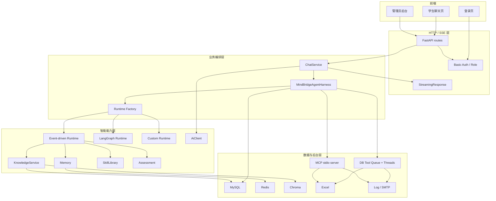
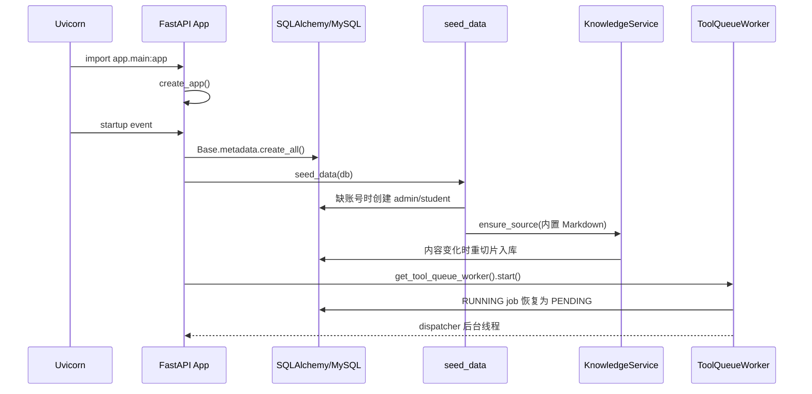
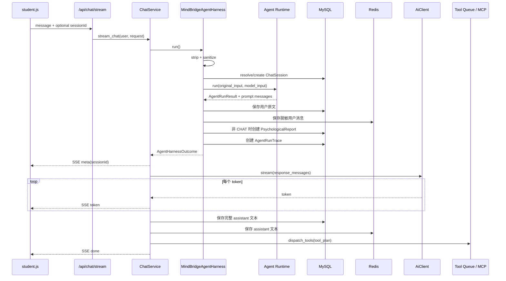
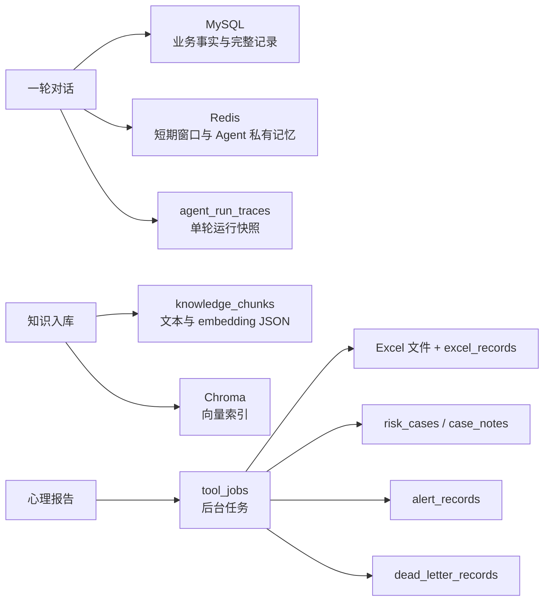

# 01｜项目总览：从 Web 请求到 Agent、数据闭环与后台工具

## 1. 面试版一句话

MindBridge 是一个面向校园心理陪伴与风险预警的 FastAPI 应用：它先对学生输入做脱敏和 Agent 编排，根据意图与风险决定是否加载记忆、检索 RAG、注入 Skill，再由模型流式生成回复；咨询/风险场景会额外沉淀心理报告、Agent trace，并通过数据库任务队列或 MCP 工具完成 Excel、风险个案和预警闭环。

这句话里包含了项目的五个关键差异点：

1. 不是“用户消息直接进 LLM”，前面有安全与上下文编排。
2. 普通聊天与心理支持走不同链路，RAG 不是每轮必查。
3. Agent Runtime 生成的是 prompt 方案，最终文本在 Runtime 之外流式生成。
4. 学生可见回复和后台风险元数据隔离。
5. 工具副作用被放在回复之后，尽量不阻塞学生端。

## 2. 系统边界

### 2.1 系统负责什么

- 学生账号与管理员账号的 Basic Auth 认证和角色隔离。
- 学生 SSE 流式聊天。
- CHAT、CONSULT、RISK 三类意图路由。
- 心理风险硬规则和模型评估。
- Redis/MySQL 会话记忆。
- 内置知识库、文件上传、混合检索与本地评测。
- 标准心理支持 Skill 的加载、选择和 prompt 注入。
- 三种 Agent Runtime。
- 咨询/风险报告、风险个案、Excel 台账和通知。
- 单轮 Agent trace 与工程 Harness。

### 2.2 系统不负责什么

- 不是真正的医疗诊断或治疗系统。
- 没有长期用户画像或语义情景记忆。
- 没有分布式消息队列和独立 Worker 集群。
- 没有 LangGraph checkpoint、人工中断恢复或跨进程图状态。
- 没有让模型自由选择任意 MCP 工具的 ReAct/function-calling 循环。
- 没有生产级账号安全、数据库迁移和密钥管理。

## 3. 分层架构



### 3.1 为什么需要 `ChatService` 和 `MindBridgeAgentHarness` 两层

`ChatService` 处理传输层问题：

- 组织 SSE 事件；
- 调用最终模型的 async stream；
- 拼接 token；
- 在流结束后保存 assistant 消息；
- 最后派发工具。

`MindBridgeAgentHarness` 处理单轮业务事务：

- 输入脱敏；
- 会话解析；
- Runtime 选择和执行；
- 用户消息写入；
- 报告创建；
- trace 持久化；
- 工具计划生成。

好处是 HTTP 路由保持很薄，三种 Runtime 也共享同一套外部业务语义。代价是 `run()` 内部包含多次独立 commit，没有形成单一事务；而且“Agent run”和“最终文本生成”分成两个阶段，trace 记录的不是最终回复文本。

## 4. 启动生命周期

入口是 `app/main.py::create_app()`。



关键细节：

- `create_all()` 只创建不存在的表，不是数据库迁移。
- 内置知识库每次启动都会遍历 `app/knowledge`；内容与数据库切片完全一致时不重建。
- Tool Queue Worker 是进程内全局单例，启动时恢复遗留 `RUNNING` 任务。
- shutdown 会 `worker.stop()`，dispatcher 最多等待 5 秒，线程池不等待未完成任务并取消未开始 future。
- 静态目录挂载在 `/`，API 路由必须先 include，避免静态挂载吞掉 API。

## 5. HTTP 入口和权限

核心学生接口：

```text
POST /api/chat/stream
GET  /api/reports/me
GET  /api/profile
GET  /api/agent/status
```

核心管理接口：

```text
GET  /api/admin/reports
GET  /api/admin/cases
GET  /api/admin/excel-records
GET  /api/admin/alerts
GET  /api/admin/tool-jobs
GET  /api/admin/dead-letters
GET  /api/admin/agent-traces
GET  /api/admin/tool-audits
GET  /api/admin/conversations/{session_id}
POST /api/admin/knowledge
POST /api/admin/knowledge/file
POST /api/admin/knowledge/rebuild-vector
POST /api/admin/knowledge/backup
```

认证路径：

1. `_credentials()` 从 `Authorization: Basic ...` 解码用户名和密码。
2. `current_user()` 查询 `user_accounts`。
3. `verify_password()` 对输入做 SHA-256，再使用 `hmac.compare_digest` 比较。
4. 管理接口通过 `require_admin()` 检查 `ROLE_ADMIN`。
5. 管理员即使有 `ROLE_USER`，也被聊天接口显式禁止发起学生对话。

这是 Demo 级认证。SHA-256 没有 salt/成本因子，Basic Token 又存于前端 `sessionStorage`，生产环境应换 Argon2/bcrypt、HTTPS 和更完整的会话/令牌机制。

## 6. 一轮请求的真实执行顺序



### 6.1 一个反直觉的顺序

用户消息是在 Runtime 返回之后才写入 MySQL/Redis。这不是漏掉当前输入，因为 Runtime 同时显式接收 `original_input` 和 `model_input`，ContextAgent 构造 `model_history` 时会把当前 `model_input` 加到历史末尾。

这个顺序的收益是：Runtime 读取到的是“上一轮以前”的历史，不会从 Redis 再读到当前消息造成重复。代价是：如果 Runtime 在保存之前抛异常，本轮用户消息完全不会落库。

### 6.2 报告和 trace 早于最终生成

报告与 trace 在最终 `AiClient.stream()` 前提交。于是：

- 模型流式生成失败时，用户消息、报告和 trace 可能已经存在；
- assistant 消息不会保存；
- 工具派发不会发生；
- trace 的 `response_messages_json` 是 prompt messages，不是最终文本；
- 当前没有“generation failed”状态与 trace 关联。

这是当前可观测性上最值得改进的断点之一。

### 6.3 工具错误不影响 `done`

工具派发位于 assistant 消息保存之后，并被 `try/except` 包裹。Queue 入队或 MCP 调用抛错时只写 warning，之后仍发送 SSE `done`。这符合“学生回复优先”的可用性策略，但前端不知道后台闭环失败，必须依赖日志、任务表或管理后台告警。

## 7. 三种 Runtime 的共同输出契约

三种 Runtime 最终都返回 `AgentRunResult`：

| 字段 | 含义 |
|---|---|
| `intent` | CHAT / CONSULT / RISK |
| `risk_level` | LOW / MEDIUM / HIGH |
| `assessment` | 心理评估 dataclass，可为空 |
| `retrieved_knowledge` | RAG SearchResult 列表 |
| `response_messages` | 供最终模型调用的 `AiMessage` 列表 |
| `steps` | 兼容管理 trace 的 AgentStep |
| `memory_brief` | 本轮记忆摘要 |
| `collaboration_events/tasks/artifacts` | 事件驱动模式额外数据；其他模式为空 |

这个兼容层很重要：Harness、报告和 ChatService 不需要知道内部是黑板协议、LangGraph 还是普通循环。

## 8. AI Provider

`AiClient` 支持：

- `ollama`：`/api/chat`，同步 complete 和异步流。
- `openai`：OpenAI-compatible `/chat/completions`。
- 其他值：Mock Provider。

事件驱动模式的 Agent 内部 LLM 调用通过 `AgentModelRegistry.client_for(agent_name)`，可以给每个 Agent 覆盖 provider/model。最终学生文本仍由 `ChatService` 中的全局 `AiClient` 生成，所以“每 Agent 独立模型”只覆盖理解、风险、上下文摘要/查询等内部调用，不自动覆盖最后一次流式生成。

## 9. 存储边界



MySQL 是系统事实源，但 Chroma、Redis、Excel 都有各自副本或派生数据；当前没有统一事务协调或 outbox。Queue 通过数据库 job 提高了后台动作的可恢复性，但 MySQL 与 Redis/Chroma/Excel 之间仍然是最终一致。

## 10. 设计优缺点

### 优点

- Runtime 通过统一结果契约可替换。
- 普通聊天跳过 RAG，降低延迟和无关知识污染。
- 高风险硬规则先于 LLM，安全关键判断不完全依赖生成模型。
- MySQL 完整记录 + Redis 短期窗口，兼顾恢复和 prompt 成本。
- 工具移到回复后，学生端体验不被 SMTP/Excel 阻塞。
- DB Queue 有重试、依赖和死信，比直接后台协程更可恢复。
- 事件、任务、artifact 能保存到 trace，利于解释 Agent 决策。

### 代价

- 多次 commit 和多存储写入没有事务原子性。
- 默认事件驱动低风险 CHAT 不加载会话历史。
- 最终文本生成位于 Agent Runtime 外，SafetyAgent 审查的是 prompt 方案而非真实输出。
- 工具治理结构尚未接入 Worker。
- Queue 是单进程轮询 + 线程池，多实例部署可能重复领取任务。
- Runtime 状态和 LangGraph 状态均不可恢复。
- 管理查询服务存在已复现的方法缩进/绑定问题。

## 11. 面试回答模板

> 项目采用“薄 HTTP 层 + 单轮 Harness + 可替换 Runtime + 数据/工具后台层”。请求先脱敏并解析会话，再由 Runtime 产生意图、风险、上下文和最终生成所需的 prompt；随后外层 AiClient 做 SSE 流式输出。咨询和风险消息会写报告与 trace，回复结束后才入队 Excel、个案和预警任务。这样把学生端时延与后台副作用解耦，也让三套 Runtime 共用同一个业务契约。当前的主要不足是跨存储没有事务、最终文本不在 SafetyAgent 审查范围内，以及部分治理和管理接口仍未完全接线。

## 12. 源码导航

- `app/main.py`
- `app/api/routes.py`
- `app/services/chat.py`
- `app/agents/harness.py`
- `app/agents/factory.py`
- `app/agents/runtime.py`
- `app/agents/event_driven_runtime.py`
- `app/agents/langgraph_runtime.py`
- `app/core/config.py`
- `app/models/entities.py`

