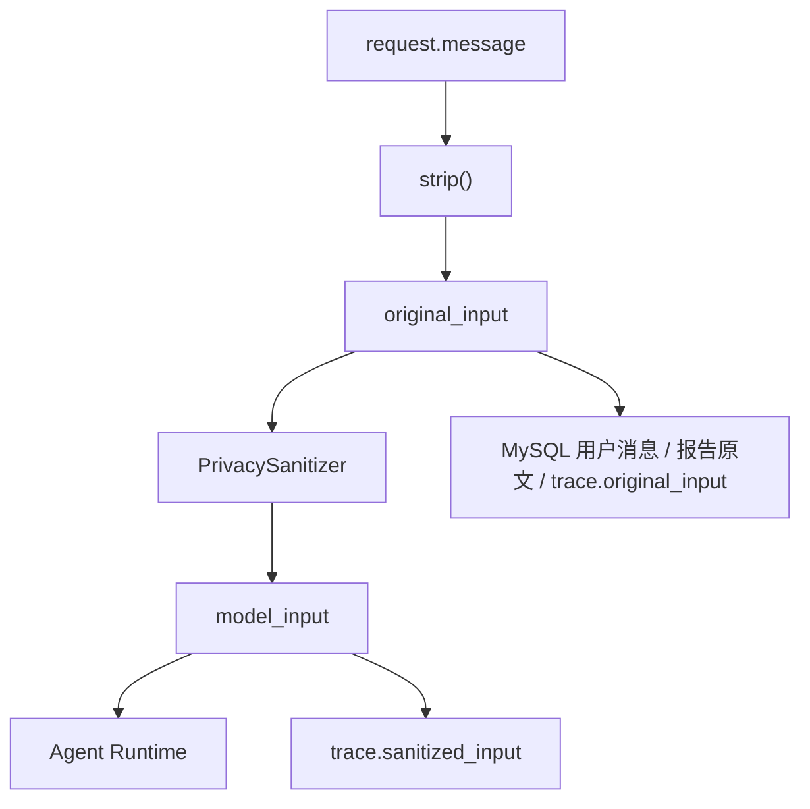
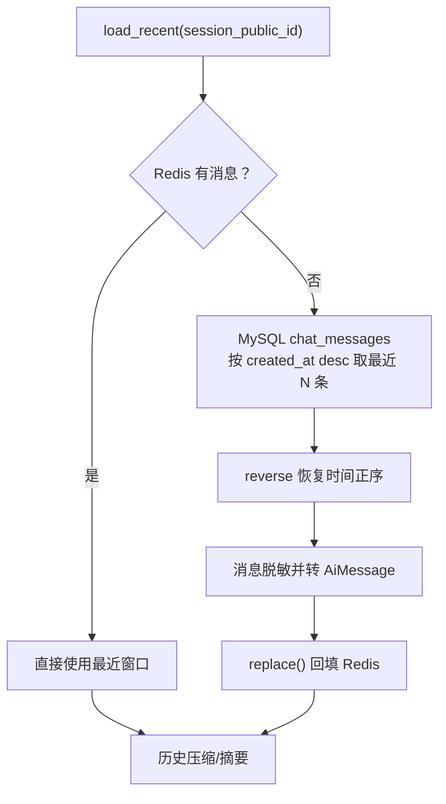
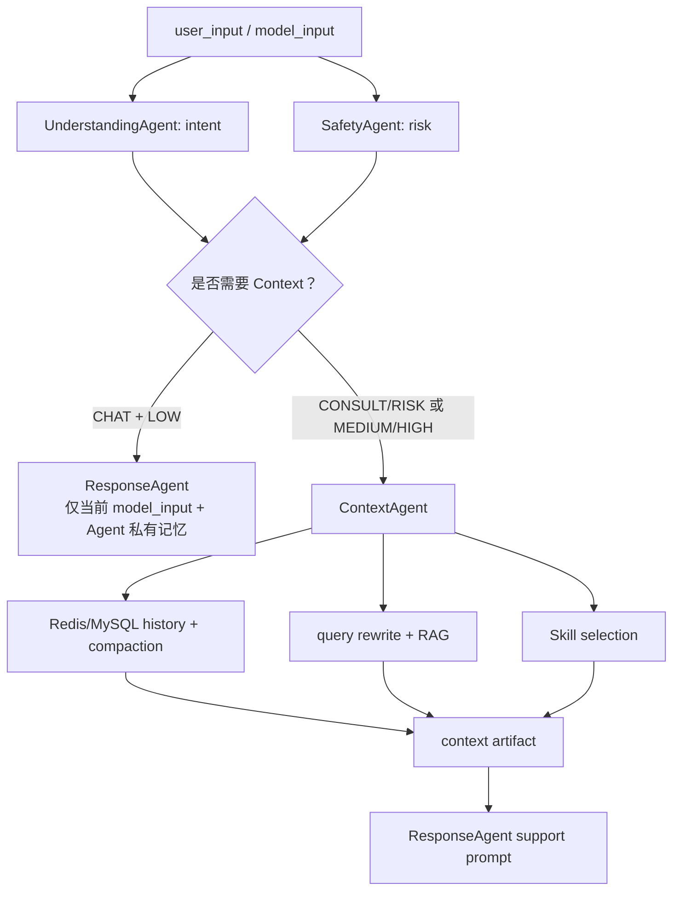
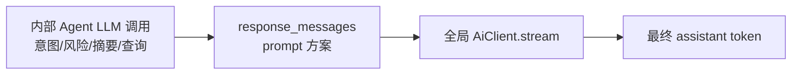

# 02｜上下文流转：输入、历史、摘要、RAG、Prompt、SSE 与 Trace

## 1. 先建立“上下文不是一个变量”的概念

项目中至少有十一种容易都被叫做“上下文”的数据：

| 名称 | 类型/位置 | 是否含敏感原文 | 生命周期 |
|---|---|---:|---|
| `original_input` | Python 字符串 | 是 | 单轮；写入 MySQL/trace/report |
| `model_input` | 脱敏字符串 | 否（仅覆盖三类标识符） | 单轮；送入 Runtime/模型 |
| Redis history | `list[AiMessage]` | 经过脱敏 | TTL + 最大条数 |
| MySQL history | `chat_messages` | 是 | 长期归档 |
| compacted history | system 摘要 + 最近消息 | 脱敏 | 本轮 prompt |
| `memory_brief` | 字符串 | 脱敏历史生成 | 本轮 + trace |
| `model_history` | `list[AiMessage]` | 脱敏 | 本轮 prompt |
| `knowledge_query` | 最多约 60 字 | 基于脱敏输入和摘要 | 本轮 |
| `retrieved_knowledge` | `list[SearchResult]` | 知识库内容 | 本轮 + trace |
| `skill_context` | 选中 Skill 正文 | 否 | 本轮 prompt |
| `response_messages` | 最终生成前的 prompt messages | 组合数据 | 本轮 + trace |
| assistant text | token 拼接结果 | 模型输出 | MySQL/Redis |

面试时如果只说“上下文存 Redis”，会遗漏工作记忆、RAG、Skill、trace 和最终 prompt 的关系。

## 2. 从请求开始的数据变形



`PrivacySanitizer` 当前只用正则替换：

- 中国大陆手机号样式；
- 邮箱；
- 18 位身份证号。

它不处理姓名、地址、学号、宿舍、IP、自由文本中的隐私描述，也没有实体识别。因此文档称其为“有限格式脱敏”，不能称为完整 PII 防护。

## 3. 历史从哪里来

Custom Runtime 的 `memory_agent()` 与事件驱动的 `ContextAgent._load_history()` 使用同一策略：



细节：

- `N` 使用 `redis_memory_max_messages`，默认 40。
- MySQL 查询只按 `session_id`，会话本身已属于当前用户。
- Redis 连接失败不会抛到上层，而是记录 warning 并返回空。
- Redis 单条 JSON 损坏时 `_read()` 跳过该条，其他消息继续使用。
- Redis role 会转小写；MySQL role 存的是 `USER/ASSISTANT` 大写枚举值。
- 回填 Redis 时写入脱敏后的历史，不会把 MySQL 原文复制进 Redis。

## 4. 当前消息为何没有重复

Runtime 在用户消息落库之前运行，所以加载的 history 不包含当前消息。随后：

```python
model_history = [
    *compacted_history,
    AiMessage(role="user", content=model_input),
]
```

当前输入只显式追加一次。之后 Harness 才把原文写入 MySQL、脱敏内容写入 Redis，供下一轮读取。

## 5. 什么时候压缩

入口是 `compact_history_for_prompt(history, settings, current_input)`。

### 5.1 触发条件

```text
memory_compaction_enabled == true
且 len(history) > memory_compaction_recent_messages
```

默认保留最近 8 条。这里按“消息条数”而不是 token 数判断，也不感知不同模型上下文窗口。

### 5.2 压缩算法

1. 再次对全部消息脱敏。
2. `summarize_history_for_memory()` 做确定性摘要。
3. 摘要最多 `memory_summary_max_chars`，默认 500 字符。
4. 如果超过阈值，返回一条 system 摘要消息 + 最近 N 条原消息。
5. 如果未超过阈值或压缩关闭，返回完整历史，但仍生成 `brief`。

确定性摘要由字符串规则拼接：

```text
学生近期关注：最近最多 4 条用户消息，每条约 80 字
已给过的支持：最近最多 3 条助手消息，每条约 70 字
本轮输入关注：当前输入最多约 80 字
```

它不是 LLM 摘要，因此稳定、便宜、可测试；代价是不会抽取结构化事实、时间关系或重要性，也可能把重复表述堆在一起。

### 5.3 还有第二个摘要

Custom Runtime 的 `_summarize_memory()` 和 ContextAgent 的同名方法还会调用 LLM，要求输出 1–3 条中文记忆要点。调用失败时回退到上面的确定性摘要。

于是本轮可能同时存在：

1. `compacted_history[0]`：确定性摘要 system message；
2. `memory_brief`：LLM 摘要；
3. Response system message 中再次插入 `memory_brief`。

这种“双摘要”增强了鲁棒性，但也增加 token 和语义不一致风险。当前没有校验 LLM 摘要是否忠于原历史。

## 6. 三种 Runtime 的上下文差异

### 6.1 事件驱动 Runtime



重要事实：默认事件驱动模式下，普通 `CHAT + LOW` 不会生成 Context task，因此不会读取会话短期历史。ResponseAgent 只得到当前 `model_input`，外加自己的 Agent 私有 Redis 记忆。这会使普通多轮闲聊的连续性弱于 Custom/LangGraph 路径。

### 6.2 Custom Runtime

Custom Runtime 每轮第一步固定运行 MemoryAgent，所以 CHAT 也会加载历史与摘要。随后 Supervisor 决定：

- CHAT：跳过 KnowledgeAgent 和 RiskGuardian，CompanionAgent 使用历史生成 prompt。
- CONSULT/RISK：继续 RAG、风险评估和 CounselorAgent。

### 6.3 LangGraph Runtime

LangGraph 使用同一个 `AgentContext` 和同一组 Custom Runtime 方法，只把“下一步选择”放进图的 conditional edges。因此上下文内容与 Custom 基本一致，也会先加载 Memory。

## 7. 事件驱动模式的 Context artifact

ContextAgent 发布：

```text
kind: context
payload:
  memoryBrief
  modelHistory
  knowledgeQuery
  retrievedKnowledge
  skillContext
  privateMemoryKey
```

这是单轮协作工作记忆。它存在于 `CollaborationBlackboard.artifacts`，最终通过 `AgentTraceService` 序列化进 `agent_steps_json`。当前没有单独的 context 表，也不会在下一轮直接恢复这个 artifact。

## 8. Prompt 如何组装

### 8.1 普通聊天

```text
system 1: PromptTemplates.answer_system_prompt(CHAT)
system 2: ResponseAgent/CompanionAgent 身份、模式、私有记忆、memory_brief
history/current user messages
```

### 8.2 心理支持

```text
system 1:
  心理支持边界
  display_name
  RAG knowledge_context
  selected skill_context
  HIGH 时 crisis_rule

system 2:
  ResponseAgent/CounselorAgent 身份
  support mode
  Agent 私有记忆
  memory_brief

history/current user messages
```

RAG 片段使用：

```text
- [source] content
```

直接拼接，没有引用编号与 token 预算，也没有 prompt injection 清洗。知识库由管理员控制，风险较低于开放 Web RAG，但上传文档仍可能包含恶意指令。

## 9. Runtime 输出到最终文本

`AgentRunResult.response_messages` 交给 `ChatService.ai.stream()`。

这是第二次模型阶段：



事件驱动 SafetyAgent 审查 `response_proposal.payload.messages` 拼接后的内容。它检查的是 prompt 中是否含高风险安全提示，不是最终生成 token。模型仍可能偏离 prompt，而生成后没有再审查。

## 10. SSE 数据流

服务端事件：

| 事件 | 时机 | 载荷 |
|---|---|---|
| `meta` | Runtime、报告和 trace 已完成后 | `type=meta, sessionId` |
| `token` | 每个模型文本块 | `type=token, content` |
| `done` | assistant 保存且工具派发尝试结束后 | `type=done` |

前端 `student.js` 并不依赖 SSE 的 `event:` 名称做分发，而是解析每个 block 的 `data:` JSON，再检查 `eventData.type`。

前端实现保留不完整 block 到下次读取，能处理网络分块。但流结束后没有解析残留 buffer；正常服务端每个事件都以双换行结束，所以通常没有影响。

前端还处理 `type=error`，但当前后端 `ChatService.stream_chat()` 没有生成 error SSE。模型流异常通常会直接中断响应，而不是产生前端期待的结构化错误。

## 11. 持久化发生在哪里

### 11.1 用户消息

`MindBridgeAgentHarness.save_message()`：

1. 新建 `ChatMessage`，内容是原文；
2. `session.touch()`；
3. commit MySQL；
4. `memory.append()`，Redis 保存脱敏内容。

MySQL 成功、Redis 失败时不会回滚 MySQL；Redis 仅 warning。

### 11.2 assistant 消息

流式生成结束后，只有 `assistant` token 列表非空才保存。中途产生部分 token 后异常时，当前生成器会抛出，保存逻辑无法执行，因此部分回复不会落库。

### 11.3 trace

trace 在最终流之前写入：

- 原始输入；
- 脱敏输入；
- intent/risk；
- memory brief；
- Agent steps；
- 事件驱动的 events/tasks/artifacts；
- RAG 结果；
- response prompt messages；
- assessment。

它不包含：

- 最终 assistant 文本；
- token 级时延；
- provider 请求 ID；
- 模型异常；
- 工具最终执行结果。

## 12. 上下文失败与降级表

| 失败点 | 当前行为 | 用户影响 |
|---|---|---|
| Redis 包不可导入 | 构造 Store 时抛 RuntimeError | 应用/请求可能失败 |
| Redis 连接/ping 失败 | client=None，warning | 使用 MySQL 回填或无短期缓存 |
| Redis 读取失败 | 返回空列表 | 尝试 MySQL |
| Redis 单条 JSON 非法 | 跳过该条 | 丢失一部分历史 |
| MySQL 历史为空 | “无相关历史记忆” | 退化为当前输入 |
| LLM 记忆摘要失败 | 使用确定性 brief | 仍可回复 |
| 查询改写失败 | 使用当前 `model_input` | RAG 质量可能下降 |
| RAG 向量失败 | BM25 路径 | 召回语义能力下降 |
| 最终 stream 失败 | 未包装 error SSE | 响应中断，assistant/工具可能未保存 |
| 工具派发失败 | warning 后继续 `done` | 学生回复成功，后台闭环可能缺失 |

## 13. 为什么这样设计

### 有价值的取舍

- 原文只进业务库，Redis/prompt 使用脱敏文本，缩小敏感面。
- Redis miss 由 MySQL 回填，服务重启或 TTL 到期后仍可恢复近期上下文。
- 确定性压缩作为 LLM 摘要 fallback，避免摘要模型失败导致整轮失败。
- ContextAgent 只在支持路径运行，减少普通问答的 RAG 成本。
- trace 在生成前保存，即使最终模型失败也能看到 Agent 决策。

### 代价

- 生成前 trace 无法描述最终真实回复。
- 基于条数的裁剪不能保证 token 不超限。
- Context 数据有重复注入。
- 多存储更新没有统一事务。
- CHAT 路径在默认 Runtime 中丢失会话历史。

## 14. 改进建议

### P0：让最终输出可审查、可追踪

把“候选文本生成”放回 Agent Runtime，或在流式输出后增加分段/完整安全审查，并给 trace 增加：

- generation status；
- final assistant text 或安全摘要；
- provider/model/request ID；
- latency/token usage；
- generation error。

### P1：token-aware Context Builder

建立统一 `ContextBuilder`：

1. 给 system、Skill、RAG、history 分配 token 预算；
2. 按重要度选择历史，而不是只按消息条数；
3. 对重复摘要去重；
4. 超预算时记录丢弃原因；
5. 三种 Runtime 共用同一结果。

### P1：补齐 CHAT 历史

事件驱动 Coordinator 可在 CHAT 路径创建轻量 Context task，只读近期记忆、不做 RAG/Skill；或让 ResponseAgent 通过受控接口取短期历史。

### P2：持久化结构化长期记忆

把经验证的用户偏好、长期目标和安全相关事实以结构化 record 保存，带来源、置信度、更新时间和删除能力。不要把 LLM 自由摘要直接当事实。

## 15. 面试回答模板

> 项目把上下文拆成原始输入、脱敏模型输入、Redis 短期历史、MySQL 归档、工作记忆、RAG 证据、Skill 约束和最终 prompt。Redis miss 时按会话从 MySQL 最近消息回填；超过消息阈值后用确定性摘要加最近窗口压缩，同时 LLM 摘要失败会回退到确定性摘要。事件驱动 Runtime 只在咨询或风险路径创建 Context artifact，普通 CHAT 默认不加载会话历史，这是当前实现的性能取舍也是连续性缺口。Runtime 最终输出 prompt messages，外层再流式生成，所以 trace 当前记录的是生成前上下文而非最终文本。

## 16. 源码导航

- `app/agents/harness.py`
- `app/services/chat.py`
- `app/services/memory.py`
- `app/agents/autonomous.py::ContextAgent`
- `app/agents/runtime.py::memory_agent`
- `app/services/trace.py`
- `app/services/privacy.py`
- `app/static/student.js::parseSse`

