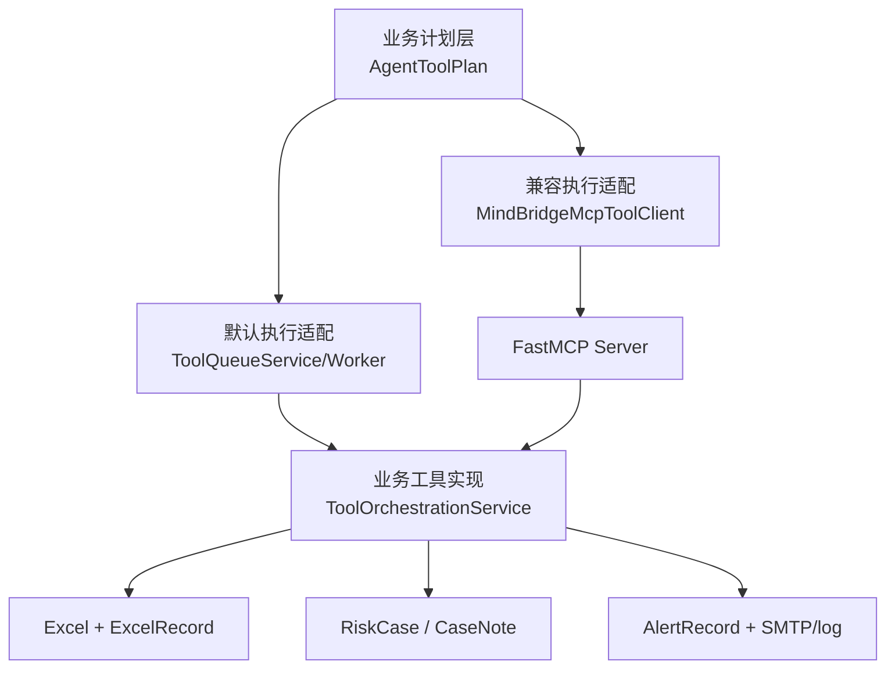
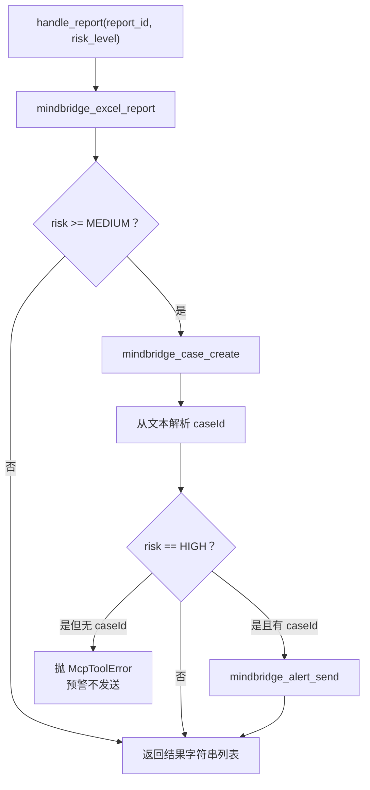
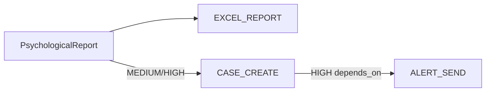

# 03｜工具调用：注册、双执行路径、结果存储、解析失败、重试与治理

## 1. 先纠正一个常见表述

当前项目“有 MCP 工具”，但主聊天链路不是典型的 LLM function calling：

```text
典型 function calling:
模型决定 tool_name + arguments
-> Runtime 校验权限和 schema
-> 执行工具
-> tool result 回填模型上下文
-> 模型继续推理

MindBridge 当前实现:
Agent 判断 intent/risk
-> Harness 按固定业务规则生成 report_id + risk_level
-> 回复流结束后按规则选择 Excel/Case/Alert
-> 队列或 MCP 执行副作用
-> 工具结果不回填本轮模型
```

因此面试时准确说法是：

> 项目使用 MCP 暴露后台工具，并提供数据库任务队列作为默认执行路径；工具编排由风险等级规则驱动，而不是由 LLM 自主返回 tool call。

## 2. 工具分成三层



### 2.1 计划层

`AgentToolPlan` 只有：

```text
report_id: int | None
risk_level: str | None
```

`requires_tools` 只判断 `report_id is not None`。它不包含工具名、参数列表、幂等键、租户、超时或权限信息。

### 2.2 执行适配层

- `tool_queue_enabled=true`：`ToolQueueService.enqueue_report()`。
- `tool_queue_enabled=false`：`MindBridgeMcpToolClient.handle_report()`。

### 2.3 业务实现层

`ToolOrchestrationService` 同时被 Queue Worker 和 MCP server 复用，避免两条路径维护两套 Excel/个案/通知逻辑。

## 3. MCP 工具如何注册

入口是 `app/mcp_tools/server.py`：

```python
mcp = FastMCP("mindbridge-python-tools")

@mcp.tool()
def mindbridge_excel_report(report_id: int) -> str:
    ...
```

FastMCP 通过函数签名、类型注解和 docstring 生成工具 schema。当前注册六个工具：

| 工具 | 参数 | 业务实现 | 返回字符串 |
|---|---|---|---|
| `mindbridge_excel_report` | `report_id` | `write_excel` | `success: <path>` |
| `mindbridge_case_create` | `report_id` | `create_case` | `success: caseId=..., reportId=..., status=...` |
| `mindbridge_alert_send` | `case_id` | `send_case_alert` | `<status>: caseId=..., channel -> recipient: message` |
| `mindbridge_alert_ack` | `case_id, actor, note` | `acknowledge_case` | `success: caseId=...` 或错误文本 |
| `mindbridge_case_note_add` | `case_id, actor, note` | `add_case_note` | `success: noteId=...` 或错误文本 |
| `mindbridge_alert_notify` | `report_id` | `notify` | `<status>: channel -> recipient: message` |

运行：

```powershell
.\.venv\Scripts\python.exe -m app.mcp_tools.server
```

server 每次调用都会：

1. `create_schema()`；
2. 创建独立 DB Session；
3. 查询 report/case；
4. 调用 `ToolOrchestrationService`；
5. finally 关闭 Session。

## 4. MCP client 如何启动与调用

`MindBridgeMcpToolClient._session()` 不连接常驻远程服务，而是为本次处理通过 stdio 启动子进程：

```text
command: 当前 Python 解释器
args: -m app.mcp_tools.server
cwd: project_root
PYTHONPATH: 加入 project_root
```

然后：

1. `stdio_client()` 获取读写流；
2. 创建 `ClientSession`；
3. `session.initialize()`；
4. `session.call_tool(name, arguments=...)`。

这种方式部署简单、工具与主项目版本一致，但每次报告都启动 MCP server 子进程，开销比复用长连接大；也没有连接池、远端鉴权或网络隔离。

## 5. MCP 路径的固定调用顺序



规则：

- 只要有心理报告，就写 Excel。
- MEDIUM/HIGH 创建风险个案。
- 只有 HIGH 发送紧急预警。

这与 Queue 路径规则保持一致。

## 6. 工具调用结果怎样解析

### 6.1 通用文本提取

`_result_message(result)`：

1. 遍历 `result.content`；
2. 有 `item.text` 就取 text，否则 `str(item)`；
3. 多段用换行拼接；
4. content 为空时读取 `structuredContent`；
5. 再没有就 `str(result)`。

如果 MCP Result 的 `isError=true`，`_call_tool()` 抛 `McpToolError`。

### 6.2 caseId 解析

创建个案后 client 使用：

```python
re.search(r"caseId=(\d+)", message)
```

它依赖 server 返回文本协议。只要工具文案改成 JSON、`case_id`、中文冒号或没有匹配数字，就得到 `None`。

### 6.3 解析失败怎么办

当 HIGH 风险但 `case_id is None`：

1. 抛 `McpToolError("...无法解析 caseId，预警未发送")`；
2. `handle_report()` 保留并向上抛；
3. `ChatService.stream_chat()` 捕获所有工具派发异常；
4. 写 warning 日志；
5. 继续发送 SSE `done`。

也就是说：

- 学生回复不失败；
- alert 不发送；
- MCP 路径没有 ToolJob、retry 或 dead letter；
- 解析失败本身没有独立数据库记录；
- 已经完成的 Excel/Case 副作用不会回滚；
- 返回给 client 的字符串列表被 `ChatService` 忽略。

### 6.4 一个更隐蔽的错误语义

MCP server 对“report/case not found”通常直接 `return "report ... not found"`，没有让 MCP Result 标记 `isError=true`。所以 client 会把这段文本当成成功结果：

- Excel not found：加入结果列表，流程继续；
- Case not found：caseId 解析失败，直到 HIGH 分支才显式报错；
- Alert not found：如果直接调用，也只是普通文本。

这说明“协议成功”和“业务成功”没有严格区分。

## 7. 默认 Queue 路径

默认配置 `tool_queue_enabled=true`，主路径不会走 MCP client，而是写数据库任务。

### 7.1 入队图



`_find_or_create()` 用 `report_id + kind` 查询 PENDING/RUNNING/SUCCESS 任务，避免重复创建活跃/成功任务。DEAD 不算现存任务，因此再次入队可以创建新 job。

### 7.2 ToolJob 字段

| 字段 | 作用 |
|---|---|
| `report_id` | 关联心理报告 |
| `kind` | EXCEL_REPORT / CASE_CREATE / ALERT_SEND / legacy RISK_ALERT |
| `status` | PENDING / RUNNING / SUCCESS / DEAD |
| `attempts` | 已开始执行的次数 |
| `max_attempts` | 每个 job 创建时复制配置值 |
| `depends_on_job_id` | Alert 对 Case Job 的依赖 |
| `run_after` | 延迟重试或限流后的下一次时间 |
| `last_error` | 最近错误或等待原因 |

## 8. Worker 怎样调度

### 8.1 启动恢复

`ToolQueueWorker.start()`：

1. Queue 关闭或 dispatcher 已存在时直接返回；
2. 把数据库所有 RUNNING 改成 PENDING；
3. 写入“服务重启后恢复未完成任务”；
4. 启动 daemon dispatcher thread。

这是 at-least-once 倾向。进程可能在外部副作用完成、job 标记 SUCCESS 之前崩溃，重启后会再次执行，所以业务工具必须幂等。

### 8.2 轮询和领取

dispatcher 每隔 `tool_queue_poll_interval_seconds`：

1. 查询 `status=PENDING and run_after<=now`；
2. 按 `created_at` 升序取 batch；
3. 逐个改为 RUNNING 并 commit；
4. 提交到对应线程池。

线程池：

- Excel 与 Case：`excel_executor`，默认 1 worker；
- Alert/Risk Alert：`email_executor`，默认 2 workers。

Case 被放入 Excel executor，不是因为它写 Excel，而是为了与台账类业务共享串行/低并发池。

### 8.3 多实例风险

查询 PENDING 与更新 RUNNING 不是数据库级原子 claim，没有 `SELECT ... FOR UPDATE SKIP LOCKED` 或 compare-and-swap。多个应用实例可能同时读到同一 job 并重复执行。单实例 Demo 没问题，横向扩容时必须改。

## 9. 依赖、限流与重试

### 9.1 依赖

`ALERT_SEND` 有 `depends_on_job_id=CASE_CREATE.id`。依赖未 SUCCESS 时：

- job 重新设为 PENDING；
- `run_after=now+2s`；
- `last_error` 写“等待风险个案创建成功”；
- 不增加 attempts。

legacy `RISK_ALERT` 没有显式依赖时，会检查 ExcelRecord 是否已经 SUCCESS。

### 9.2 限流

Alert 类任务进入进程内 `RateLimiter`：

- 用 `deque[monotonic timestamp]` 保存最近 60 秒事件；
- 有锁，线程安全；
- 达到上限时计算 `retry_after`；
- job requeue，且不增加 attempts。

局限：

- 服务重启后计数清空；
- 多实例之间不共享额度；
- 在真正发送前占用额度，后续执行失败也不会退还。

### 9.3 失败重试

真正执行前：

1. `attempts += 1` 并 commit；
2. 调用 `_execute()`；
3. 成功后标记 SUCCESS。

异常时：

```text
attempts < max_attempts
    -> PENDING
    -> run_after = now + retry_delay * attempts

attempts >= max_attempts
    -> DEAD
    -> 插入 dead_letter_records
```

这是线性退避，不带 jitter。默认最大 3 次。

### 9.4 为什么先增加 attempts

进程如果在工具执行中崩溃，这一次仍被计入尝试；重启恢复 RUNNING 后继续重试。它避免无限“开始但不计数”，但某些因进程中断未真正触达外部系统的尝试也会消耗次数。

## 10. 结果到底存在哪里

这是本模块最重要的细节。

| 动作 | 业务结果 | 调度结果 | 文件/外部副作用 |
|---|---|---|---|
| Excel | `excel_records` SUCCESS | `tool_jobs` SUCCESS/DEAD | `.xlsx` 增加一行 |
| Create Case | `risk_cases` | `tool_jobs` SUCCESS/DEAD | 无 |
| Alert | `alert_records` SUCCESS/FAILED；case 状态可能变 ALERT_SENT | `tool_jobs` SUCCESS/重试/DEAD | log 模式或 SMTP |
| Ack Case | `risk_cases` + `case_notes` | MCP 直接调用时无 ToolJob | 无 |
| Add Note | `case_notes` | MCP 直接调用时无 ToolJob | 无 |
| Dead Letter | `dead_letter_records` | job=DEAD | 无 |
| Governance Audit | 设计为 `tool_audit_records` | 当前未接线 | 无 |

### 10.1 Excel 结果

`write_excel()` 先查同 report 的 SUCCESS `ExcelRecord`，命中就直接返回，避免重复写。

没有命中时：

1. 创建父目录；
2. 进程内全局 `EXCEL_WRITE_LOCK`；
3. 加载或创建 workbook；
4. append 一行；
5. 保存文件；
6. 插入 SUCCESS ExcelRecord。

如果 workbook 保存成功但数据库 commit 失败，下次重试仍可能再追加一行，因为没有 SUCCESS record。反过来，ExcelRecord 只有成功记录，没有 FAILED 记录，失败详情主要留在 ToolJob/DeadLetter。

### 10.2 Case 结果

`risk_cases.report_id` 有唯一约束，代码也先查询，所以具备业务幂等性。Case 保存：

- 风险等级；
- 状态；
- owner；
- report summary；
- 由 `counselor_handoff_summary` Skill 渲染的交接摘要。

### 10.3 Alert 结果

`notify()` 先查同 report 的 SUCCESS AlertRecord，有则直接返回。log 模式也会记录 SUCCESS。SMTP/配置错误会插入 FAILED AlertRecord，再由 Queue `_execute()` 看见 FAILED 后抛异常，触发重试。

因此同一 report 可以积累多个 FAILED AlertRecord，最终再出现一个 SUCCESS。管理端查看的是所有最近记录。

### 10.4 MCP 返回结果

MCP client 的 `list[str]` 只存在于调用栈；`dispatch_tools()` 返回后，`ChatService` 没有保存或展示它。真正可审计的信息依赖工具内部写入的业务表，而不是 MCP response 本身。

## 11. 工具治理是否真的生效

### 11.1 已有结构

`ToolPolicyRegistry` 定义：

- 每种工具允许的风险等级；
- 是否要求 report；
- 未知工具默认拒绝。

`ToolGovernanceService` 可以：

- `start_job()` 创建 AUTHORIZED/BLOCKED ToolAuditRecord；
- `require_allowed()` 强制拒绝；
- `finish()` 写最终状态和 payload。

单元测试验证了 policy 纯函数。

### 11.2 当前接线事实

`tool_queue.py` import 了 `ToolGovernanceService`，但 `_run_job()` 和 `_execute()` 都没调用它。MCP server 也不调用。结果：

- 🔴 policy 不会阻断真实任务；
- 🔴 `tool_audit_records` 不会由主链路写入；
- 🔴 AgentProfile 的 `tool_permissions` 也没有执行器校验；
- ✅ 入队规则本身仍按 risk 决定任务种类，但这是编排规则，不是治理拦截。

面试时可以说“设计了工具治理骨架和测试，但当前未接入执行路径”，不能说“已经实现完整工具权限控制”。

## 12. 故障矩阵

| 故障 | Queue 路径 | MCP 路径 |
|---|---|---|
| report 不存在 | job 重试后 DEAD | 普通文本，可能被误当成功 |
| caseId 解析失败 | 不需要文本解析 | 抛 McpToolError，alert 不发 |
| Excel 文件损坏 | 重试/死信 | 抛到 client，再被 ChatService 记录 warning |
| SMTP 配置缺失 | FAILED AlertRecord + 重试/死信 | 返回 FAILED 文本，但 MCP Result 未必 isError |
| 限流 | PENDING 延迟，不消耗 attempt | 无限流 |
| 服务重启 | RUNNING 恢复 PENDING | 本次调用中断，无恢复记录 |
| 多实例重复 claim | 可能发生 | 每次请求独立调用 |
| 工具派发整体异常 | 学生仍收到 done | 学生仍收到 done |

## 13. 为什么默认用 Queue 而保留 MCP

### Queue 的优势

- 不阻塞回复；
- 任务状态可恢复；
- 有重试、依赖、限流和死信；
- 业务副作用可以稍后执行。

### Queue 的缺点

- 不是标准 Agent 工具交互；
- 单进程线程池扩展性有限；
- 多实例领取不安全；
- 结果不会回填模型。

### MCP 的优势

- 工具以标准协议暴露；
- 可被其他 MCP client 复用；
- 业务实现与 Queue 共用。

### MCP 的缺点

- 当前每次启动子进程；
- 字符串协议脆弱；
- 没有 retry/dead letter；
- 错误语义不严格；
- 仍不是模型自主工具循环。

## 14. 改进路线

### P0：治理接入执行器

Queue 在执行前：

```text
audit = start_job(job, report)
require_allowed(job, report)
execute
finish(audit, SUCCESS, payload)
```

异常和 BLOCKED 也要 `finish()`，并决定 BLOCKED 是直接 DEAD 还是独立状态。MCP server 也应复用同一授权层。

### P0：结构化 Tool Result

统一返回：

```json
{
  "ok": true,
  "tool": "mindbridge_case_create",
  "reportId": 12,
  "caseId": 8,
  "status": "OPEN",
  "errorCode": null,
  "message": "..."
}
```

client 优先读取 `structuredContent`，不再用正则解析人类文案。not found 必须是 `ok=false`/MCP error。

### P1：可靠领取和 Outbox

- 用事务性 outbox 在创建报告同一事务内写工具事件；
- Worker 用 `FOR UPDATE SKIP LOCKED` 或原子状态更新领取；
- 加 lease/heartbeat，避免长任务被永久 RUNNING；
- 让多实例安全扩容。

### P1：统一可观测性

为每次执行保存：

- correlation/turn/trace/report/job ID；
- tool name/version；
- 输入参数的脱敏快照；
- 开始/结束时间和 latency；
- attempt；
- structured result/error code；
- external provider message ID。

### P2：真正的 Agent Tool Loop

如果业务需要模型根据上下文选择工具，可新增受限 Tool Executor：

1. registry 暴露 schema；
2. 每 Agent capability/permission 过滤；
3. 模型只产生候选 call；
4. policy + human approval 决定是否执行；
5. result 作为 tool message 回填；
6. 循环有步数、成本和安全预算。

心理高风险场景仍应保留确定性强制动作，不能完全交给模型决定。

## 15. 面试回答模板

> 工具层有两个执行适配：默认是数据库 ToolJob + 后台线程池，关闭队列时走 stdio MCP。MCP server 用 FastMCP 装饰器注册六个工具，但主链路的工具选择由 report 和 risk_level 确定，不是模型自主 function calling。Queue 对 Excel、Case、Alert 建依赖图，有幂等检查、限流、线性退避和死信；业务结果分别写 ExcelRecord、RiskCase、AlertRecord，调度状态写 ToolJob。MCP 路径把 result content 拼成字符串，并用正则提取 caseId，解析失败会阻止 alert，但异常只记日志且不影响学生回复。项目有 ToolGovernanceService 和审计表，不过当前没有接到 Worker，这是我会优先补齐的治理缺口。

## 16. 源码导航

- `app/agents/harness.py::dispatch_tools`
- `app/services/tool_queue.py`
- `app/services/tools.py`
- `app/services/mcp_client.py`
- `app/mcp_tools/server.py`
- `app/services/tool_governance.py`
- `app/models/entities.py::ToolJob`
- `app/models/entities.py::ToolAuditRecord`
