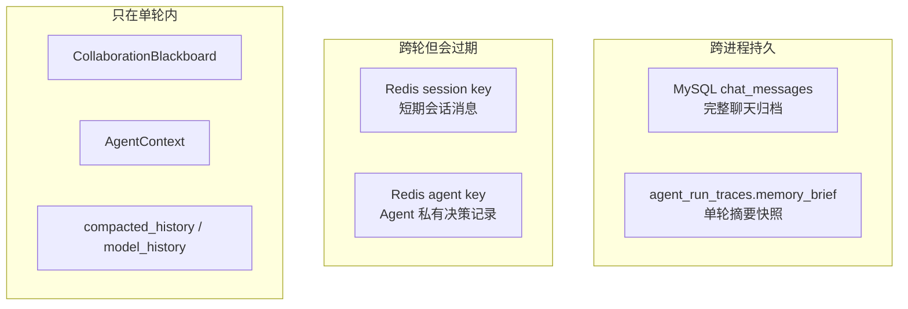
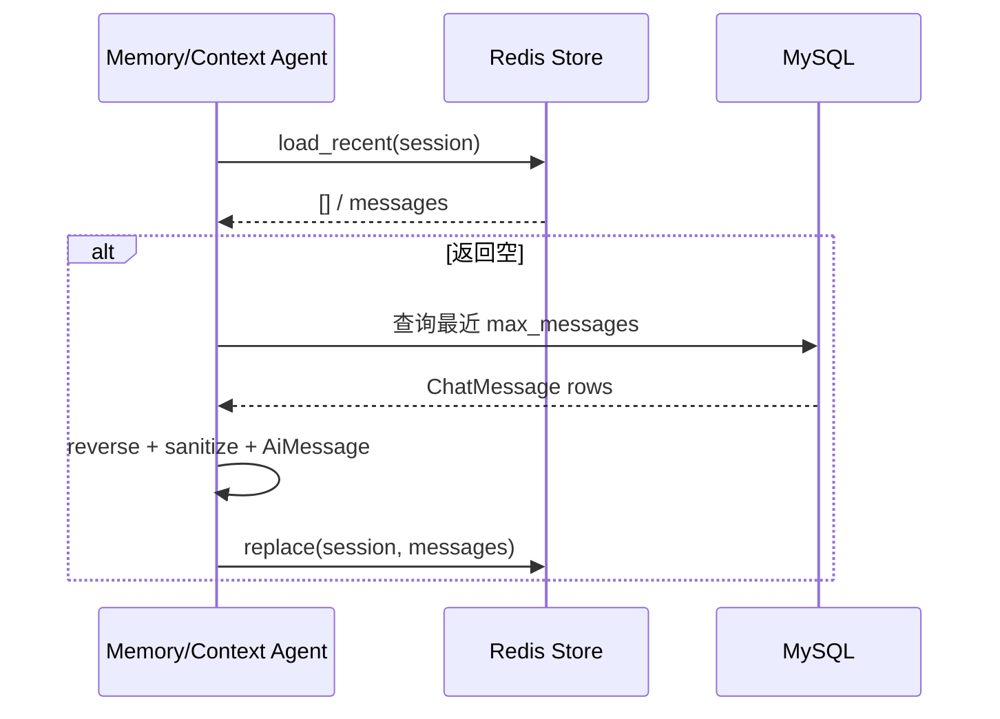
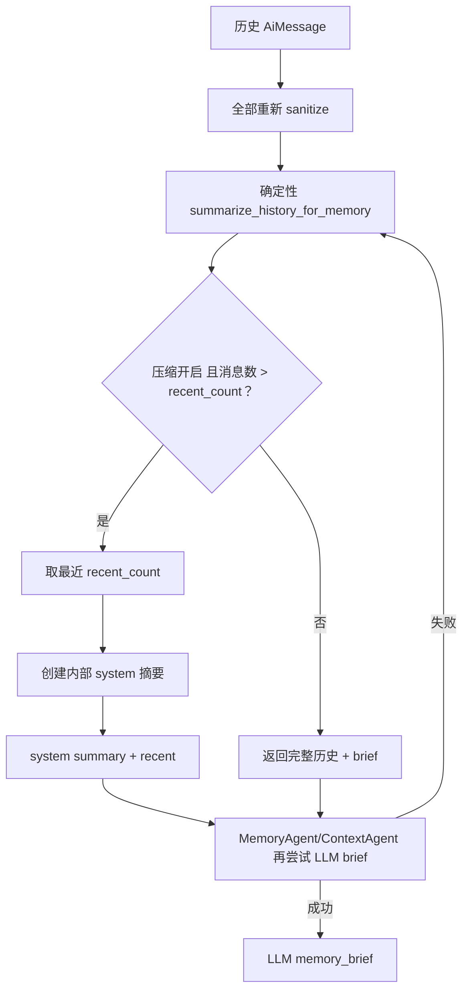

# 04｜记忆模块：短期、长期归档、工作记忆、私有记忆与压缩

## 1. 项目里有哪几种“记忆”



| 记忆类型 | 当前实现 | 准确评价 |
|---|---|---|
| 短期记忆 | Redis list + TTL + 最大条数 | ✅ 已实现 |
| 长期聊天记录 | MySQL `chat_messages` | ✅ 已实现为归档 |
| 长期语义记忆 | 无向量化用户事实/画像库 | 🔴 未实现 |
| 工作记忆 | Blackboard 或 AgentContext | ✅ 单轮实现 |
| Agent 私有记忆 | 按 Agent 隔离的 Redis key | 🟡 已实现，内容较简单 |
| 摘要记忆 | 本轮确定性/LLM brief | 🟡 生成并进 trace，但不作为独立长期记忆恢复 |

## 2. 短期记忆怎样存

类：`RedisShortTermMemoryStore`。

Key：

```text
mindbridge:short-term-memory:{session_public_id}
```

Value 是 Redis List，每一项为 JSON：

```json
{
  "role": "user",
  "content": "脱敏后的文本",
  "createdAt": "UTC ISO timestamp"
}
```

写入 `append()`：

1. `rpush(key, payload)`；
2. `ltrim(key, -max_messages, -1)`；
3. `expire(key, ttl_seconds)`。

TTL 每次 append 都刷新，所以它是“滑动过期”。只要会话持续活跃，key 会持续存在。

### 为什么用 Redis List

优点：

- 追加和取最近窗口简单；
- `LTRIM` 能把空间稳定在固定上限；
- TTL 自动清理不活跃会话；
- role/content 保留顺序。

缺点：

- 只能按时间窗口读取，不能按语义或重要度检索；
- 删除/修订单条记忆不方便；
- 不支持结构化用户事实；
- TTL 与条数是粗粒度控制，不是 token 预算。

## 3. Redis 读取与损坏处理

`load_recent()` 调 `_read()`：

```text
LRANGE key -limit -1
-> 每条 json.loads
-> JSONDecodeError: 跳过
-> role/content 为空: 跳过
-> content 再次 sanitize
-> AiMessage
```

整个 Redis 调用异常时只 warning 并返回空列表。上层通常把“空”理解为 cache miss，再从 MySQL 回填；但“Redis 真空”“连接失败”“读取异常”没有结构化区分。

## 4. MySQL 是怎样的长期记忆

`chat_messages` 保存：

- `user_id`
- `session_id`
- `role`
- `content`
- `created_at`

内容是原始用户输入或最终 assistant 文本，不经过 Redis 的脱敏替换。

它具备长期保存能力，但系统只在 Redis 返回空时：

```text
按 session_id
order by created_at desc
limit redis_memory_max_messages
reverse
```

因此它是“长期聊天归档 + 短期缓存恢复源”，不是典型 Agent 长期记忆：

- 不会跨 session 检索同一用户历史；
- 不会做向量搜索；
- 不会抽取用户偏好/目标/事实；
- 不会按重要度召回；
- 超过最近 N 条的旧消息不会进入 prompt。

面试时可以说“长期记录已实现，长期语义记忆未实现”。

## 5. Redis miss 怎样回填

Custom Runtime 和 ContextAgent 都有相似逻辑：



`replace()` 使用 pipeline：

1. delete key；
2. rpush 全部消息；
3. ltrim；
4. expire；
5. execute。

如果 `pipe.execute()` 失败只 warning。由于命令在同一 pipeline 中发送，但没有显式 `transaction=True/False` 说明，使用 redis-py 默认事务 pipeline；代码本身不依赖这个细节保证跨 MySQL 一致性。

## 6. Agent 私有记忆

事件驱动模式通过 `AgentPrivateMemory` 包装同一个 Redis Store。

逻辑 key 被作为 `session_public_id` 传入：

```text
agent:{AgentName}:{session_public_id}
```

Store 再加统一前缀，真实 Redis key 是：

```text
mindbridge:short-term-memory:agent:{AgentName}:{session_public_id}
```

写入 role 固定为 `system`。各 Agent 记录：

| Agent | 记忆内容示例 |
|---|---|
| UnderstandingAgent | `intent=...; topic=...` |
| SafetyAgent | 风险与 summary；安全审查是否通过 |
| ContextAgent | intent/risk/召回条数 |
| ResponseAgent | response mode/intent/risk |
| CoordinatorAgent | accepted artifact 与原因 |

### 隔离做到了什么

- key 按 AgentName 和 session 分开；
- Agent 默认只通过自己的 `private_memory()` 读取；
- prompt 可注入最近最多 5 条自己的记录；
- Profile 中声明各自 `memory_policy`。

### 没做到什么

- `memory_policy` 只是字符串说明，没有策略执行器；
- 没有 ACL 阻止开发者直接构造别的 Agent key；
- 没有独立 TTL/容量配置，沿用普通短期记忆的设置；
- 内容是日志式字符串，不是结构化记忆；
- 不区分可信事实、模型推断和过期决策；
- 不会主动遗忘错误结论。

因此它更接近“Agent 私有短期日志”，而不是成熟的认知记忆系统。

## 7. 工作记忆

### 7.1 Custom/LangGraph：`AgentContext`

`AgentContext` 是可变 dataclass，字段包括：

- 各阶段完成布尔位；
- memory brief；
- intent/risk/assessment；
- knowledge query/results；
- model history；
- response prompt；
- Agent steps。

Custom Runtime 在 for-loop 中原地更新；LangGraph 把它包在 `GraphState = {"context": AgentContext}` 中，各节点仍原地修改同一个对象。

### 7.2 事件驱动：`CollaborationBlackboard`

Blackboard 保存：

- tasks dict；
- messages tuple；
- artifacts tuple；
- events tuple；
- final artifact id。

dataclass 是 frozen，更新方法返回 `replace(...)` 后的新 Board；事件、消息和 artifact 以 tuple append，旧 Board 不变。

但它不是严格事件存储：

- `tasks` 是可变 dict，只是在方法里 copy；
- task metadata、artifact payload 也是 dict；
- 没有持久化 event log；
- 同一轮结束后只把序列化快照写 trace；
- 不能从 trace 重放并恢复继续执行。

## 8. 压缩的完整流程



### 确定性摘要的安全约束

system message明确写：

- 仅供内部上下文；
- 不向学生展示；
- 不据此输出诊断、风险等级或后台标签。

LLM 摘要 prompt 也要求不输出风险等级或诊断。

### 压缩什么时候不发生

- history 为空；
- `memory_compaction_enabled=false`；
- 消息数不超过 recent_count。

但即使不压缩，仍生成 `brief` 供 prompt/trace。

## 9. 上下文的第二次裁剪

压缩后还会 `_bounded_model_history()`：

```text
limit = max(2, chat_history_limit * 2)
```

默认 `chat_history_limit=10`，所以最多 20 条。如果列表第一条是 system summary，会保留它，再保留尾部 19 条；否则只保留尾部 20 条。

这造成两层条数预算：

1. Redis 最大消息数，默认 40；
2. compaction recent，默认 8；
3. model history 上限，默认 20。

默认开启压缩时，第 2 层通常先把历史变成 9 条，所以第 3 层不会再裁剪。关闭压缩时第 3 层才明显生效。

## 10. 不同 Runtime 的记忆行为

| Runtime | CHAT | CONSULT/RISK | 私有记忆 |
|---|---|---|---|
| Event-driven | 不运行 ContextAgent，不读取会话历史 | ContextAgent 读取/压缩历史 | 有 |
| LangGraph | Memory 节点总是先运行 | Memory 节点总是先运行 | 无 |
| Custom | MemoryAgent 总是先运行 | MemoryAgent 总是先运行 | 无 |

这是三种 Runtime 并非完全行为等价的证据。它们共享 `AgentRunResult` 输出契约，但上下文召回策略不同。

## 11. 记忆写入时序

```text
Runtime 先读取旧历史并运行
-> 保存用户原文到 MySQL
-> 保存用户脱敏文本到 Redis
-> 最终模型生成
-> 保存 assistant 完整文本到 MySQL
-> 保存 assistant 文本到 Redis（仍会做格式脱敏）
```

如果最终生成失败，历史里可能出现孤立 user 消息，没有 assistant 配对。当前下一轮没有专门识别这种失败轮次。

## 12. 隐私边界

| 位置 | 保存内容 |
|---|---|
| MySQL ChatMessage | 原文 |
| PsychologicalReport.content | 原文 |
| AgentRunTrace.original_input | 原文 |
| AgentRunTrace.sanitized_input | 脱敏 |
| Redis session/private memory | 脱敏 |
| 模型 prompt | 主要使用脱敏输入/历史 |
| Excel | report ID、risk、emotion、confidence、summary，不写完整原文 |
| Case handoff/email | 包含截断后的原始表达，可能含未脱敏信息 |

最后一项很重要：`counselor_handoff_summary()` 直接使用 `report.content` 的截断文本，没有调用 PrivacySanitizer。它面向辅导员/管理员，有业务理由保留含义，但需要更严格权限、审计和传输安全。

## 13. 失败与恢复

| 故障 | 行为 |
|---|---|
| Redis 不可达 | 本轮 Store client=None；从 MySQL 取历史 |
| Redis 之后暂时故障 | load/append/replace warning，不阻断 |
| MySQL 不可达 | 主请求失败，没有离线记忆 |
| 某条 Redis JSON 损坏 | 跳过 |
| LLM 摘要异常 | deterministic brief |
| 历史过长 | 按条数压缩/裁剪，不保证 token |
| 服务重启 | Blackboard/AgentContext 丢失；Redis/MySQL 保留 |
| TTL 到期 | Redis miss，MySQL 最近窗口回填 |

## 14. 设计取舍

### 优点

- MySQL 是耐久事实，Redis 是可丢缓存，职责相对清楚。
- 写 Redis 前脱敏，降低缓存泄露影响。
- Redis 不可用时自动降级，聊天可用性较高。
- 确定性摘要让测试和 fallback 可控。
- Agent 私有 key 避免所有角色共用一段无边界日志。

### 缺点

- “长期记忆”只是一份消息表。
- 压缩按消息数/字符数，不按 token 和重要度。
- 摘要不持久化为可版本化的 memory record。
- 私有记忆是字符串日志，没有事实校验。
- 两套 Runtime 的记忆行为不一致。
- MySQL 原文、trace 原文和 handoff 原文扩大敏感数据面。

## 15. 改进方案

### 分层 Memory Service

```text
Conversation Buffer
    最近原始轮次，短 TTL

Conversation Summary
    带 source turn IDs、version、生成模型

User Facts
    结构化、可验证、可删除、带置信度与过期时间

Episodic Memory
    重要事件向量索引，跨 session 召回

Safety Memory
    独立权限与保留策略，不直接注入普通聊天
```

写入长期事实前应有：

- 提取；
- 去重；
- 与已有事实冲突检测；
- 置信度/来源；
- 用户隐私与删除策略；
- 高风险信息的额外权限。

### token-aware 压缩

用目标模型 tokenizer 估算：

```text
system budget
+ skill budget
+ RAG budget
+ memory summary budget
+ recent turns budget
+ output reserve
<= model context window
```

### 可观测性

暴露：

- Redis available/miss/fallback；
- loaded message count；
- compaction before/after tokens；
- summary source=LLM/deterministic；
- dropped turns；
- memory latency。

## 16. 面试回答模板

> 项目把记忆分成四层：MySQL 保存完整聊天作为长期归档，Redis List 保存有 TTL 和条数上限的短期窗口，事件驱动模式还按 Agent 和 session 建隔离 Redis key，单轮工作记忆则是 Blackboard 或 AgentContext。Redis miss 时从 MySQL 最近消息回填。历史超过阈值后会先生成确定性摘要并保留最近消息，随后尝试 LLM 生成更自然的 memory brief，失败就回退。当前没有真正的长期语义用户记忆，且默认事件驱动 Runtime 的普通 CHAT 不加载会话历史，这是我会通过统一 ContextBuilder 和结构化长期记忆层改进的地方。

## 17. 源码导航

- `app/services/memory.py`
- `app/models/entities.py::ChatMessage`
- `app/agents/autonomous.py::AgentPrivateMemory`
- `app/agents/autonomous.py::ContextAgent`
- `app/agents/events.py::CollaborationBlackboard`
- `app/agents/runtime.py::AgentContext`
- `tests/test_memory_compaction.py`
- `tests/test_privacy_and_assessment.py`

