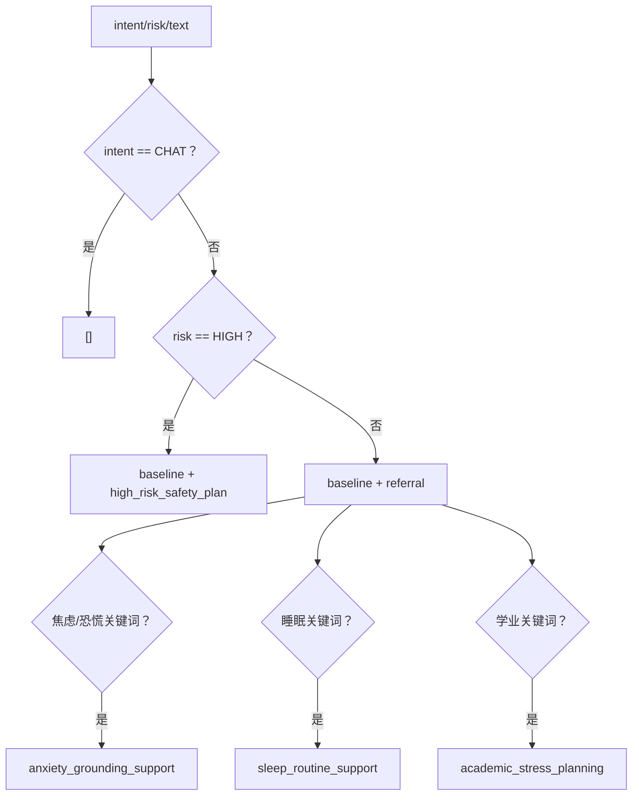

# 06｜Skill 模块：SKILL.md 加载、校验、选择、注入与渐进式披露

## 1. Skill 在项目中的定位

MindBridge 的 Skill 不是可执行 Python 插件，也不是 MCP Tool。它是带 frontmatter 的 Markdown 规则包，在特定心理场景被拼接进模型 system prompt，或作为后台交接模板。

```text
Tool
    产生外部副作用：写 Excel、建个案、发通知

Skill
    给模型或模板渲染器提供工作流程和表达约束
```

当前共 7 个 Skill：

| Skill | 用途 |
|---|---|
| `supportive_response_baseline` | 所有心理咨询/风险回复的基本共情和边界 |
| `high_risk_safety_plan` | 高风险短期安全计划 |
| `anxiety_grounding_support` | 焦虑、恐慌、grounding |
| `sleep_routine_support` | 失眠和作息 |
| `academic_stress_planning` | 考试、论文、学业压力 |
| `referral_resource_guidance` | 校内/现实支持转介 |
| `counselor_handoff_summary` | 面向辅导员/管理员的交接摘要模板 |

## 2. 文件格式

路径：

```text
skills/<skill-name>/SKILL.md
```

结构：

```markdown
---
name: anxiety_grounding_support
description: Use when ...
---

# Anxiety Grounding Support

## Workflow

- ...
```

加载后得到 `MindBridgeSkill`：

- `name`
- `description`
- `body`
- `path`
- `metadata`

`prompt_context()` 输出：

```text
应用 skill: <name>
<body>
```

## 3. Registry 如何发现 Skill

`MindBridgeSkillRegistry` 默认 root：

```text
Path(app/services/skills.py).parents[2] / "skills"
```

`list_skills()`：

1. root 不存在时返回空；
2. 用单层子目录的 `SKILL.md` glob 模式扫描；
3. 排序；
4. 对每个文件 `_load_skill_file()`；
5. 任一文件格式错误会让 `list_skills()` 整体抛 `SkillLoadError`。

注意 `status_items()` 与 `list_skills()` 行为不同：它逐文件捕获 `SkillLoadError`，所以能返回部分 READY、部分 FAILED 的状态列表。

## 4. Frontmatter 解析不是完整 YAML

`_split_frontmatter()` 是手写解析器：

1. 文件必须以 `---\n` 开头；
2. 查找下一个 `\n---`；
3. 每个非空、非注释行必须含冒号；
4. 只在第一个冒号处分割 key/value；
5. 去掉简单引号；
6. 所有 metadata 都是字符串。

优点：

- 无额外 YAML 依赖；
- 格式严格；
- 行为容易测试。

限制：

- 不支持嵌套对象、数组、多行字符串；
- 不处理 YAML 类型；
- UTF-8 BOM 会导致开头检查失败；
- closing delimiter 后是否有额外字符没有严格校验；
- metadata schema 只有 name/description 在加载时被要求。

## 5. 加载时校验

硬错误：

- 缺 frontmatter；
- frontmatter 未结束；
- 无效 metadata 行；
- name 为空；
- description 为空；
- body 为空；
- `counselor_handoff_summary` 缺 text fenced template。

软警告：

- 目录名与 name 不一致；
- body 缺 `## Workflow`；
- description 长度小于 20。

状态：

```text
解析失败或 ERROR issue -> FAILED
有 WARN issue           -> WARN
无 issue                -> READY
```

## 6. Skill 如何选择

入口：`MindBridgeSkillLibrary.response_skill_names(intent, risk, text)`。



### 精确规则

- CHAT：没有 Skill。
- HIGH：只选择 baseline 和 high-risk plan，不再追加睡眠/学业等低优先级 Skill。
- 非 HIGH 的 CONSULT/RISK：
  - 固定 baseline；
  - 固定 referral；
  - 根据关键词追加 anxiety/sleep/academic；
  - `_dedupe()` 保留第一次出现顺序。

这种路由是确定性的，能保证高风险时安全 Skill 优先且 prompt 不被大量普通建议稀释。

## 7. Skill 正文怎样进入 Prompt

`response_skill_context()`：

1. 计算 names；
2. 新建 Registry；
3. 对每个 name 调 `get_required()`；
4. `prompt_context()`；
5. 两个 Skill 之间用双换行拼接。

随后：

```text
ContextAgent
-> context artifact.skillContext
-> ResponseAgent
-> PromptTemplates.answer_system_prompt(..., skill_context)
-> system message
```

Custom/LangGraph 由 CounselorAgent 直接调用同一 SkillLibrary。

Skill 不作为独立 message，而是嵌入主 system message中的“可用 skill 指引”区域。

## 8. 是否做了渐进式披露

答案是：**做了粗粒度的 prompt 选择性披露，但没有完整多级渐进式披露。**

### 已做到

| 能力 | 状态 |
|---|---|
| 先根据 intent/risk/text 选择名称 | ✅ |
| CHAT 不加载正文进 prompt | ✅ |
| 只把选中的正文拼进模型上下文 | ✅ |
| 高风险用更小、更专门的 Skill 集 | ✅ |

### 没做到

| 完整渐进式披露常见能力 | 当前状态 |
|---|---|
| 启动时只加载 name/description 目录 | 🔴 每次读取文件正文 |
| 模型根据 description 自主决定是否展开 | 🔴 硬编码关键词选择 |
| 选中后才读取单个 Skill 文件 | 🟡 prompt 只用选中正文，但 `get_required` 会扫描全部文件 |
| Skill 正文再按需加载 references/assets | 🔴 无 references/assets 协议 |
| 缓存 registry/catalog | 🔴 每次新建 Registry |
| token 预算和冲突处理 | 🔴 无 |
| 版本、依赖和优先级 | 🔴 无 |

### 一个具体性能细节

`get_required(name)` 内部调用 `list_skills()`，而 `response_skill_context()` 对每个选中 name 都调用一次 `get_required()`。

如果选中 5 个 Skill、目录中有 7 个文件，当前实现会进行 5 次目录扫描，并重复读取/解析最多 35 个文件。模型上下文只披露 5 个正文，但文件 I/O 并不渐进。

## 9. Staff-facing 模板 Skill

`counselor_handoff_summary` 不进入学生回复 prompt，而是：

```text
ToolOrchestrationService.create_case
-> MindBridgeSkillLibrary.counselor_handoff_summary(report, user)
-> registry.template_for()
-> 提取第一个 text fenced block
-> 字符串替换占位符
-> RiskCase.handoff_summary
```

占位符包括：

- report_id；
- student；
- risk_level；
- emotion；
- confidence；
- summary；
- next_steps；
- content_excerpt。

渲染器是简单 `str.replace()`：

- 不检查未知占位符；
- 不检查必填占位符是否全部使用；
- 不做 HTML/Markdown escaping；
- content excerpt 只截断到 700 字，不脱敏。

由于结果只作为 plain text 展示/邮件正文，注入风险低于 HTML 模板，但隐私与模板完整性仍需关注。

## 10. Skill status 怎样暴露

`GET /api/agent/status` 返回 `MindBridgeSkillLibrary.status_items()`，包括：

- name；
- READY/WARN/FAILED；
- description；
- path；
- issues；
- metadata。

⚠️ 当前 Windows 本地运行时，path 是：

```text
skills\academic_stress_planning\SKILL.md
```

Engineering Harness 却检查 `endswith("/SKILL.md")`，导致 Standard Skills 和 API 两个 Harness 失败。Skill 本身加载正常，失败的是跨平台路径断言/输出规范不一致。

## 11. 测试覆盖

单元测试覆盖：

- 合法 Skill 加载；
- warning 状态；
- 缺 frontmatter 抛错。

Engineering Harness 计划覆盖：

- 7 个标准 Skill 齐全；
- 全部 READY；
- 咨询关键词组合选择；
- HIGH 只选择两项；
- context 包含正文；
- handoff template 渲染。

但当前在 path 断言处提前失败，后续断言虽然代码存在，却没有在完整 Harness 运行中执行完。

## 12. 设计优缺点

### 优点

- Skill 与 Python 逻辑分离，非开发者可审阅文案规则。
- 高风险 Skill 集确定、可测试。
- 通用支持、场景支持和 staff handoff 分开，职责清楚。
- 不把全部 Skill 注入每轮 prompt，减少 token 和冲突。
- parser/validation/status 为运营检查提供基础。

### 缺点

- 选择逻辑硬编码在 Python，不使用 description。
- 文件重复扫描，没有缓存。
- 没有优先级、依赖、互斥和 token budget。
- Skill 指令之间没有冲突检测。
- 缺少版本、变更审计和灰度。
- 完整正文一次性注入，不能继续按章节展开。
- status path 跨平台不统一。

## 13. 改进路线

### P0：稳定接口和缓存

- 所有 API path 输出用 POSIX 形式；
- Registry 启动时构建 catalog；
- 用文件 mtime/hash 做失效；
- `get_required()` O(1) 按 name 查，不重复扫描。

### P1：真正的渐进式披露

```text
Level 1: Catalog
  name、description、triggers、priority、estimated_tokens

Level 2: Main workflow
  选中时才读 SKILL.md 主体

Level 3: References
  workflow 指向的专业规则按需读取

Level 4: Assets/Templates
  只有具体输出需要时加载
```

### P1：声明式路由

Frontmatter 增加：

```yaml
intents: [CONSULT, RISK]
risks: [LOW, MEDIUM]
triggers: [焦虑, panic]
priority: 50
exclusive_group: safety-mode
max_tokens: 500
```

运行时组合确定性规则与轻量分类器，输出选择理由写入 trace。

### P2：Skill 编译与验证

- 占位变量 schema；
- 未解析占位符检查；
- 冲突规则 lint；
- token 上限；
- 高风险不可缺少条款；
- 快照测试；
- prompt injection 测试；
- 版本和发布状态。

## 14. 面试回答模板

> 项目的 Skill 是标准化 Markdown 指令包，不是可执行工具。Registry 扫描 `skills/<name>/SKILL.md`，手写解析 frontmatter并做结构校验；Runtime 根据 intent、risk 和关键词选择 Skill，把选中的正文拼到心理支持 system prompt。CHAT 不注入 Skill，高风险固定只使用 baseline 和 safety plan，避免普通建议稀释安全约束。它实现了模型上下文层面的选择性披露，但还不是完整渐进式披露，因为 `get_required` 会重复加载全部文件，也没有 catalog、references/assets 多级展开、缓存和 token 预算。

## 15. 源码导航

- `app/services/skills.py`
- `skills/<skill-name>/SKILL.md`
- `app/agents/autonomous.py::ContextAgent`
- `app/agents/runtime.py::counselor_agent`
- `app/services/tools.py::create_case`
- `tests/test_skills.py`
- `app/harness/runner.py::run_standard_skills_harness`
