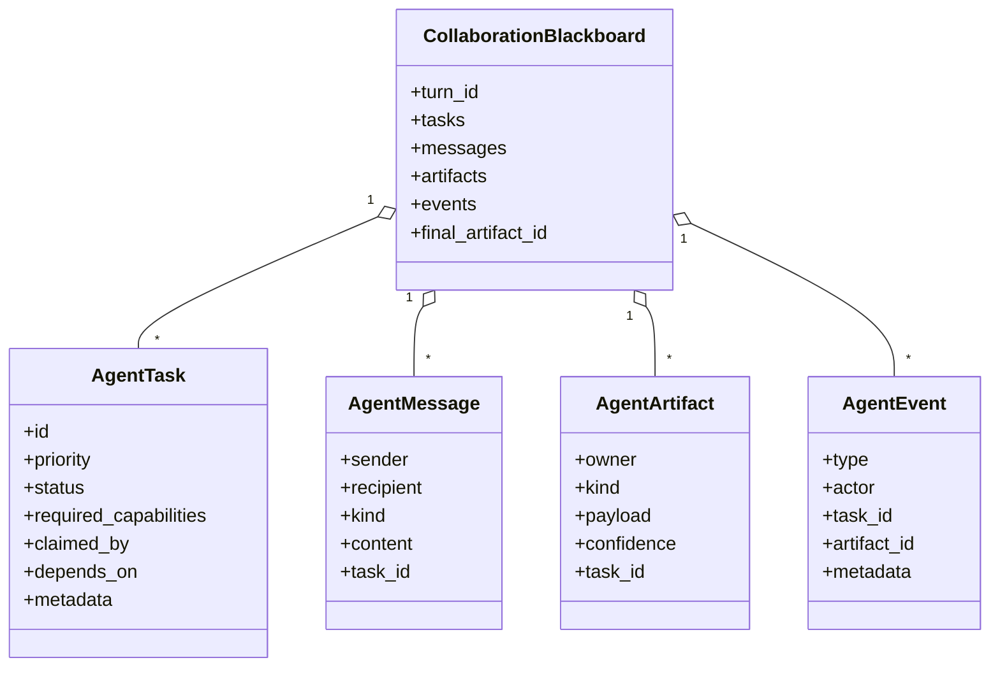
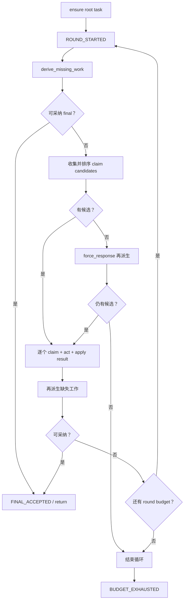
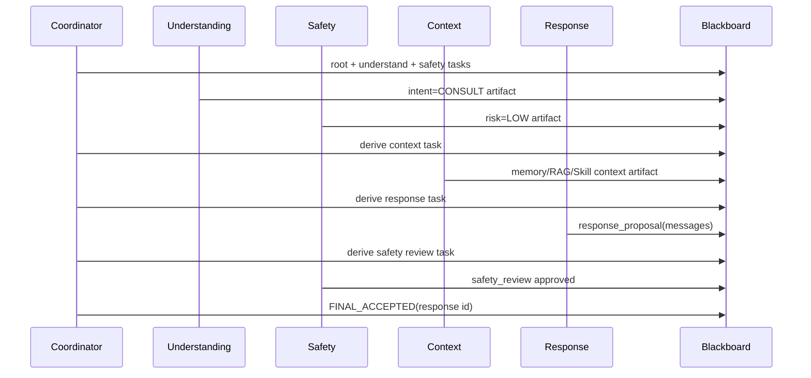

# 07｜事件驱动多 Agent：协议、黑板、任务、Claim、Artifact、事件与状态流转

## 1. 这套多 Agent 属于哪一种模式

项目中可以区分三种编排形态：

| 形态 | 实现 | 控制方式 |
|---|---|---|
| 事件驱动/Actor 风格多 Agent | `EventDrivenAgentRuntimeService` | 任务板 + Agent 自主 claim + Coordinator 采纳 |
| LangGraph workflow | `LangGraphAgentRuntimeService` | controller 条件边 + 固定节点 |
| 普通自研 Runtime | `AgentRuntimeService` | 固定 agent 列表扫描 |

本篇只讲第一种。

“事件驱动”需要准确理解：项目建模了 Event、Message、Task、Artifact 和 per-Agent inbox 语义，但执行仍在一个 Python 请求线程中同步循环。它不是基于 Kafka/async mailbox 的分布式 Actor System，也没有 Agent 真并行。

## 2. 核心协议对象



### 2.1 Task

`AgentTask` 描述待解决工作：

- `required_capabilities` 决定哪些 Agent 有资格；
- `priority` 是 LOW/NORMAL/HIGH/CRITICAL；
- `status` 是 OPEN/CLAIMED/BLOCKED/CLOSED；
- `claimed_by` 是 tuple，可记录多个 Agent；
- `depends_on` 字段存在，但 Coordinator 当前不检查依赖；
- `metadata.kind` 等字段驱动 Agent 决策。

状态方法：

```text
claim(agent) -> CLAIMED，并追加 claimed_by
reopen()     -> OPEN
close()      -> CLOSED
```

`BLOCKED` 枚举当前没有实际状态转换逻辑。

### 2.2 Claim

Agent 的 `decide(task, board)` 返回：

```text
AgentDecision:
  claim: bool
  confidence: float
  reason: str
```

`AgentClaim` dataclass 虽然定义了，但 Coordinator 实际使用的是 `AgentCandidate(agent, decision)`，没有实例化 `AgentClaim`。

### 2.3 Message

`AgentMessage`：

- recipient 是具体 AgentName 或 `*`；
- `messages_for(agent)` 只是从共享 tuple 过滤；
- 消息不会出队、ack 或删除；
- Agent 当前很少真正读取 `messages_for()`，主要协作依据是 artifact。

所以“per-agent inbox”是共享 mailbox 的只读视图，而不是独立消息队列。

### 2.4 Artifact

Artifact 是协作事实：

| kind | owner | 关键 payload |
|---|---|---|
| `intent` | UnderstandingAgent | intent/topic/reason |
| `risk` | SafetyAgent | risk/emotion/assessment |
| `context` | ContextAgent | memory/RAG/Skill |
| `response_proposal` | ResponseAgent | prompt messages/mode |
| `safety_review` | SafetyAgent | approved/reason/response ID |
| `critique` | SafetyAgent | rejected reason/response ID |

Artifact 不覆盖旧值，而是追加；`latest_artifact(kind)` 从后向前取最新。这样保留修订历史，但 payload 没有 schema 版本或 Pydantic 校验。

### 2.5 Event

EventType 包括：

- TURN_STARTED
- TASK_CREATED/CLAIMED/RELEASED/CLOSED
- MESSAGE_SENT
- ARTIFACT_PUBLISHED/CRITIQUE_PUBLISHED
- REVISION_REQUESTED
- SAFETY_OVERRIDE
- FINAL_ACCEPTED
- ROUND_STARTED
- BUDGET_EXHAUSTED

其中 `TASK_RELEASED` 当前没有发布路径。Event 是 trace/解释数据，不会触发独立异步 consumer。

## 3. Blackboard 的“追加式”语义

`CollaborationBlackboard` 是 frozen dataclass。方法通常返回 `replace(...)` 后的新实例；旧 Board 不变。`add_artifact()` 自动追加发布事件，`send_message()` 自动追加消息事件，`apply_turn_result()` 统一合并 Agent 输出。

### 这是不是 event sourcing

不是完整 event sourcing：

- 当前状态以 tasks dict 和 final_artifact_id 直接保存；
- 不能只靠 events 完整重建所有 payload；
- Board 不持久化到 event store；
- trace 是结束后的 JSON 快照；
- 没有 replay/version/snapshot 机制。

更准确叫“单轮内复制式黑板 + 追加式审计事件”。

## 4. Agent Registry

`AgentRegistry.candidate_decisions_for()`：

1. 遍历注册顺序中的 Agent；
2. 先检查 task.required_capabilities 是否是 Agent capabilities 子集；
3. 调 `agent.decide()`；
4. 只保留 claim=true；
5. 按 decision confidence 降序。

能力检查使 Coordinator 无需知道具体 Agent 类，但只有 capability 不足以决定工作，Agent 仍可根据当前 artifacts 拒绝。

## 5. Coordinator 完整循环



预算：

- `agent_max_rounds` 默认 8；
- `agent_max_claims_per_round` 默认 4；
- `agent_max_claims_per_agent` 默认 3；
- final response confidence 至少 0.6。

## 6. Root Task 和派生任务

### Root Task

CoordinatorAgent 创建：

```text
id = task:root
kind = root
priority = CRITICAL if hard high-risk signal else NORMAL
required_capabilities = empty
```

没有 required capability，因此多个 Agent 可以根据自己的 `decide()` claim root。

### 派生任务

Coordinator 根据缺失 artifact 创建：

| Task | Capability | 条件 |
|---|---|---|
| `task:understand` | UNDERSTANDING | 无 intent |
| `task:assess-safety` | SAFETY | 无 risk |
| `task:gather-context` | CONTEXT | CONSULT/RISK 或 MEDIUM/HIGH 且无 context |
| `task:propose-response` | RESPONSE | intent/risk 就绪，context 条件满足 |
| `task:review-response:<id>` | SAFETY | 当前 proposal 没有匹配 review |
| `task:revise-response:<critique>` | RESPONSE | critique.approved=false |

`_ensure_task()` 只按 task.id 去重。动态 review/revision ID 允许多轮修订。

## 7. 候选排序与“批量 Claim”

Coordinator 为每个 OPEN task 收集候选，然后按：

```text
priority
-> decision confidence
-> agent name
```

降序排序。

一轮选择约束：

- 同一 Agent 最多选一次；
- 最多 max_claims_per_round；
- 没有限制同一 task 只能被一个 Agent 选择。

所以 UnderstandingAgent 和 SafetyAgent 可以在同一轮 claim 同一个无 capability root task。实现随后仍是 for-loop 顺序执行，不是真并行。

一个细节：第一个 Agent 可能已经把 task 关掉，第二个候选仍来自本轮预先计算的列表；代码会取当前 CLOSED task，再调用 `claim()` 把它改回 CLAIMED，然后执行并再次关闭。这允许“同一任务多 Agent 独立处理”，但状态机语义不够严格。

## 8. 各 Agent 怎样自治

### 8.1 UnderstandingAgent

职责：只发布 intent，不生成最终回复。

分类顺序：

1. high-risk 硬关键词 -> RISK；
2. 没有咨询词且命中通用任务词 -> CHAT；
3. 调自己的模型做 CHAT/CONSULT/RISK；
4. 模型异常 -> 基于咨询关键词回退。

产物还含 topic 和 privateMemoryKey。

### 8.2 SafetyAgent

有两种工作：

1. 输入风险评估；
2. 候选回复安全审查。

风险评估先调用 `PsychologicalAssessmentService`；硬高风险关键词会绕过模型直接 HIGH。HIGH 发布 SAFETY_OVERRIDE。

一个执行时序细节：第一轮 Risk task 通常在 Context task 之前，所以 `_context_history(board)` 往往只有当前输入，历史对事件驱动风险评估的作用有限。Custom/LangGraph 则在风险评估前先加载历史。

安全审查：

- 找到最新 response proposal；
- 拼接其中 messages 的 content；
- HIGH 时检查是否包含“高风险处理规则、当前安全、可信任的人、紧急”等提示；
- 通过 -> `safety_review`；
- 不通过 -> `critique` + REVISION_REQUESTED + revision task。

它审查的是 prompt 方案中有没有安全指令，不是最终模型文本。

### 8.3 ContextAgent

只在支持链路工作：

- Redis/MySQL 历史；
- 压缩和记忆摘要；
- query rewrite；
- RAG；
- Skill context；
- 发布 context artifact。

CHAT + LOW 不创建 Context task。

### 8.4 ResponseAgent

前置条件：

- 必须有 intent 和 risk；
- 支持路径需有 context，HIGH 可例外；
- 普通 CHAT 可直接 proposal。

它发布的 `messages` 是最终生成 prompt，不调用 LLM 生成学生文本。

### 8.5 CoordinatorAgent

不通过 Registry claim 普通任务；`decide()` 永远 false。它由 EventDrivenCoordinator 直接调用，用于建 root task、记录 final acceptance，并代表最终采纳者。

## 9. 正常 CONSULT 时序



具体在几轮发生取决于同轮 candidate 的预计算与 claim 预算，但依赖关系大致如此。

## 10. 高风险覆盖

硬高风险信号同时影响：

- root task priority=CRITICAL；
- Safety task priority=CRITICAL；
- Understanding 直接 RISK；
- Assessment 直接 HIGH；
- SafetyAgent 发布 SAFETY_OVERRIDE；
- `_select_intent()` 看见 override 后强制 RISK；
- `_select_risk()` 强制 HIGH；
- Context/Response/Review task 提高优先级；
- Prompt 注入 high-risk Skill 和 crisis rule；
- Harness 创建报告并计划 Case + Alert。

这种 defense-in-depth 的优点是单一 LLM 判断失败不会把明确危机降为普通聊天。

## 11. Revision 流程的局限

当 SafetyAgent reject proposal：

1. 发布 `critique`；
2. 创建 revision task；
3. ResponseAgent 允许在 metadata 有 `revisionOf` 时再次 claim；
4. 生成新的 response proposal。

但 ResponseAgent 的 `act()` 没有读取 critique reason，也没有把修改要求放入 prompt；它大概率生成与前一个相同结构的 messages。若拒绝原因不是由默认 high-risk system rule自动解决，可能重复失败直到预算耗尽。

## 12. Final acceptance

必须同时满足：

1. 有最新 response proposal；
2. 有 safety_review；
3. review.metadata.responseArtifactId 等于最新 proposal.id；
4. approved=true；
5. proposal.confidence >= threshold。

然后 Coordinator 私有记忆记录 accepted，Board 指向 proposal，并追加 FINAL_ACCEPTED。

## 13. 预算耗尽后的真实行为

Coordinator 返回带 BUDGET_EXHAUSTED 的 Board。Runtime `_to_result()` 使用：

```python
accepted = board.accepted_artifact() or board.latest_artifact("response_proposal")
```

这意味着即使 proposal 没被最终采纳，只要存在最新 proposal，仍可能被作为 `response_messages` 使用。没有 proposal 才生成 fallback prompt。

这是一个安全语义缺口：协议说需要 Safety approval，但适配结果时允许未采纳 proposal 逃逸。建议在 HIGH 场景中只允许 accepted artifact，否则使用确定性的安全 fallback。

## 14. Agent 隔离

### Prompt

每个 AgentProfile 有独立 system prompt。

### Model

`AgentModelRegistry`：

1. AgentName 映射 alias；
2. 查 agent-specific provider/model；
3. 空值回退全局默认；
4. shallow copy Settings；
5. 创建独立 AiClient。

温度和 max_tokens 代码支持动态属性读取，但 `Settings` 当前只显式声明了每 Agent provider/model，没有声明每 Agent temperature/max_tokens 环境字段；Pydantic extra=ignore 会忽略未声明 env，因而这些动态覆盖实际上难从配置注入。

### Memory

每个 Agent 独立 Redis key。

### Tools

Profile 声明 `tool_permissions`，但没有执行器 enforcement，因此目前是文档元数据。

## 15. Trace 怎样保存协作

`EventDrivenAgentRuntimeService._events_to_steps()` 先把每个 Event 转为 AgentStep。

`AgentTraceService._agent_steps_with_collaboration()` 又：

1. 加入 `agent_run.steps`；
2. 再加入原始 collaboration events；
3. 加入 tasks；
4. 加入 artifacts。

因此 `agent_steps_json` 中同一事件会以 AgentStep 和 `kind=agent_event` 两种结构出现。信息完整，但重复且客户端需要识别多种 schema。

## 16. “事件驱动”与“异步并行”的边界

当前：

- Agent `decide/act` 是同步函数；
- Coordinator 在一个 for-loop 里顺序调用；
- claim batch 不并行；
- mailbox 是内存 tuple；
- Board 只在当前请求内；
- 无后台 Agent worker；
- 无持久化 task lease；
- 无跨机器事件总线。

所以准确说法：

> 这是事件模型和 Actor 职责风格的单进程同步多 Agent Runtime，为未来异步化建立了协议边界，但当前没有真并行执行。

## 17. 设计优缺点

### 优点

- Agent 通过 capability 和 artifact 解耦，不写死固定链表。
- Blackboard 保留中间产物，便于审计。
- Safety 独立于 Understanding/Response。
- final acceptance 绑定具体 response artifact，避免审查旧版本。
- Agent 可配置独立模型与私有记忆。
- 有 round/claim/agent 预算避免无限自治。

### 缺点

- 同步执行却有复杂事件模型，成本高于收益。
- task depends_on/BLOCKED/TASK_RELEASED 等协议未落地。
- Message 基本没有驱动行为，artifact 才是实际总线。
- payload 无 schema 校验。
- Revision 不消费 critique。
- 预算耗尽可能使用未批准 proposal。
- 风险评估通常早于历史 Context。
- 最终文本不在 Safety 审查内。

## 18. 改进路线

### P0：封死安全旁路

- HIGH 只接受 `accepted_artifact()`；
- budget exhausted 使用静态安全 prompt；
- 最终生成后增加 safety gate；
- trace 明确 acceptance/budget status。

### P1：严格 Task 状态机

- 每 task 每轮一个 owner，或显式允许 multi-claim；
- 检查 status 后再执行预选候选；
- 实现 depends_on；
- BLOCKED/RELEASED 有真实迁移；
- 用 Pydantic/TypedDict 校验 artifact payload。

### P1：让 Revision 真正修订

ResponseAgent prompt 必须包含 critique reason、rejected artifact ID、必须修改的安全约束和 previous proposal 摘要。

### P2：异步 Actor 化

如果吞吐需要：

- 持久化 Task/Event store；
- 每 Agent mailbox；
- lease/ack/retry；
- correlation/causation ID；
- 并行理解与风险评估；
- Coordinator 只消费产物；
- 超时和取消；
- deterministic replay。

不要为了“多 Agent”标签盲目分布式化；当前任务规模小，同步模型更易控制。

## 19. 面试回答模板

> 默认 Runtime 用 append-style Blackboard 协作。Coordinator 不写死 Agent 顺序，而是根据缺失的 intent、risk、context、response 和 safety review artifact 动态创建 Task；Registry 先按 capability 过滤，再由每个 Agent 的 decide 给出 claim 和置信度，Coordinator按优先级和置信度选候选。Agent 通过 Artifact 共享结果，通过 Event 留审计轨迹，SafetyAgent 可以发布 SAFETY_OVERRIDE，最终只有与最新 proposal 绑定且 approved 的 review 才允许 Coordinator 接受。需要说明的是当前 act 仍同步顺序执行，不是真 Actor 并行；此外 budget exhausted 会回退到最新未采纳 proposal，这是现有安全缺口。

## 20. 源码导航

- `app/agents/events.py`
- `app/agents/registry.py`
- `app/agents/coordinator.py`
- `app/agents/autonomous.py`
- `app/agents/event_driven_runtime.py`
- `app/services/agent_models.py`
- `tests/test_event_driven_multi_agent.py`

