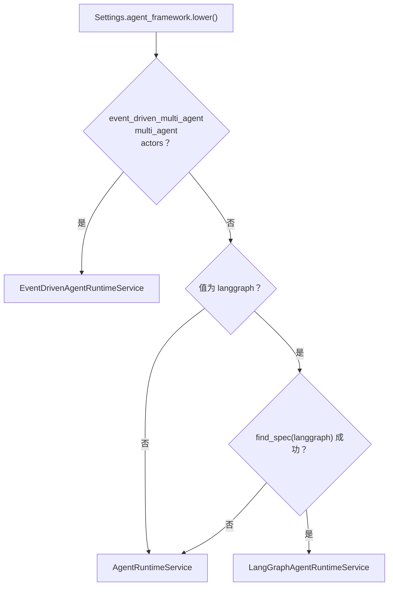
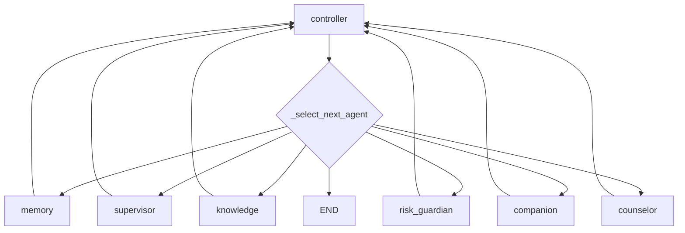

# 08｜Runtime 对比：事件驱动、LangGraph 与普通自研循环

## 1. Runtime Factory

唯一选择入口是 `app/agents/factory.py::create_agent_runtime(db, settings)`。



`agent_framework_status()` 同时向状态 API 暴露：

- requested；
- active；
- langgraphAvailable；
- fallback。

## 2. “默认值”取决于环境

| 来源 | 值 |
|---|---|
| `Settings.agent_framework` 代码默认 | `event_driven_multi_agent` |
| 当前本地非敏感配置读取结果 | `event_driven_multi_agent` |
| `docker-compose.yml` 中 app 默认 | `langgraph` |
| Engineering Harness | 强制 `custom` |

所以面试时不要笼统说“项目默认 LangGraph”或“默认事件驱动”，应说明配置来源。当前源码类默认是事件驱动，但容器模板主动覆盖成 LangGraph。

## 3. 共同输出契约

三套 Runtime 都实现：

```python
run(
    user: UserAccount,
    session: ChatSession,
    original_input: str,
    model_input: str,
) -> AgentRunResult
```

`AgentRunResult.requires_report`：

```text
intent != CHAT
```

因此报告创建只依赖最终 intent，不直接依赖 risk。CONSULT 即使 LOW 也创建报告；CHAT 即使某处 risk 被错误提高但 intent 仍 CHAT，则不创建报告。当前三套 Runtime 通常会让高风险 intent 对齐为 RISK。

## 4. 普通自研 Runtime

类：`AgentRuntimeService`。

### 4.1 控制算法

```python
agents = [
    memory_agent,
    supervisor_agent,
    knowledge_agent,
    risk_guardian_agent,
    companion_agent,
    counselor_agent,
]

for step in range(1, max_steps + 1):
    if context.finished:
        break
    for agent in agents:
        if agent(step, context):
            break
```

每个 outer step 最多执行一个 Agent。Agent 用 `AgentContext` 中的完成位判断自己是否可运行。

### 4.2 CHAT 路径

```text
Step 1 MemoryAgent
Step 2 SupervisorAgent -> CHAT
Step 3 CompanionAgent -> finished
```

Supervisor 对 CHAT 直接设：

```text
knowledge_handled = true
risk_assessed = true
```

所以跳过 Knowledge 和 RiskGuardian。

### 4.3 CONSULT/RISK 路径

```text
Step 1 MemoryAgent
Step 2 SupervisorAgent
Step 3 KnowledgeAgent
Step 4 RiskGuardianAgent
Step 5 CounselorAgent -> finished
```

优点：

- 最容易读；
- 路径确定；
- 无框架依赖；
- 适合 fallback 与测试。

缺点：

- 顺序写死；
- 新 Agent 要插列表并设计布尔位；
- 没有中间产物版本、并行和审查回路；
- “哪个 Agent 下一步运行”由列表顺序与 if 条件隐式共同决定。

## 5. LangGraph Runtime

类：`LangGraphAgentRuntimeService`，继承 Custom Runtime，复用全部业务 Agent 方法。

### 5.1 GraphState

```python
class GraphState(TypedDict):
    context: AgentContext
```

只有一个 key，并且 `AgentContext` 本身是可变对象。各 graph node 原地修改它。

### 5.2 图结构



controller 节点本身不修改 state，只提供统一路由点。

### 5.3 下一节点选择

`_select_next_agent()` 与 Custom 的完成位一一对应：

```text
memory not loaded -> memory
intent not routed -> supervisor
CHAT -> companion
knowledge not handled -> knowledge
risk not assessed -> risk_guardian
response not planned -> counselor
else -> end
```

因此它是把固定状态机显式画成图，不是让 LLM Supervisor 动态选任意节点。

### 5.4 步数与 recursion limit

`max_steps=8` 来自父类。Graph invoke 的：

```text
recursion_limit = max_steps * 3 + 2 = 26
```

因为每个业务节点前后都要经过 controller，图节点执行次数大于业务 AgentStep 数。

`_run_agent()`：

- context.finished 或 steps >= max_steps -> finished；
- 调具体 agent；
- 如果 agent 没运行且 steps 没增加 -> finished。

### 5.5 项目没有使用的 LangGraph 能力

- checkpointer；
- thread_id；
- durable execution；
- interrupt；
- human-in-the-loop；
- State reducers；
- parallel branches；
- subgraphs；
- Command；
- time travel/replay。

所以当前 LangGraph 的价值主要是“控制流可视化和框架化”，而不是持久化 Agent 平台。

## 6. 事件驱动 Runtime

类：`EventDrivenAgentRuntimeService`。

主要步骤：

1. 构造 `AgentRuntimeServices`；
2. 创建 Coordinator 和四个 worker Agent；
3. 创建 Blackboard；
4. 发布 TURN_STARTED；
5. Registry + EventDrivenCoordinator；
6. 协作结束后 `_to_result()` 适配到 AgentRunResult。

它不复用 Custom 的 Agent 方法，而是另一套 AutonomousAgent 实现。

## 7. 三者的控制流比较

| 维度 | Event-driven | LangGraph | Custom |
|---|---|---|---|
| 状态容器 | Blackboard | AgentContext 包在 GraphState | AgentContext |
| 下一步决定 | 缺失 artifact + claim | 条件边 | 列表扫描 + 布尔位 |
| Agent 顺序 | 不写死，但受 task/priority 决定 | 固定状态机 | 固定列表 |
| 安全审查回路 | 有 proposal/review/revision | 无 | 无 |
| 多候选 | 有 claim confidence | 无 | 无 |
| 执行方式 | 同步顺序 | 同步 graph invoke | 同步循环 |
| 可视化 | 需从 events/diagram理解 | 图结构天然清楚 | 最简单 |
| 外部依赖 | 无额外编排框架 | langgraph | 无 |
| checkpoint | 无 | 无 | 无 |
| 私有 Agent 记忆 | 有 | 无 | 无 |
| 每 Agent 模型 | 有 | 无 | 无 |

## 8. 三者的业务行为并不完全一致

统一结果契约不等于语义一致。

### 8.1 会话记忆

- Event-driven CHAT + LOW：不创建 Context task，不加载普通会话历史。
- LangGraph/Custom：每轮先 Memory。

### 8.2 风险评估上下文

- Event-driven：Safety 通常在 Context 之前，主要看当前输入。
- LangGraph/Custom：RiskGuardian 在 Memory、Knowledge 之后，传入 model_history。

### 8.3 普通聊天模型

- Event-driven：ResponseAgent 创建 prompt，最终全局 AiClient stream。
- LangGraph/Custom：CompanionAgent 创建 prompt，最终同样由全局 AiClient stream。

### 8.4 内部模型隔离

- Event-driven：Understanding/Safety/Context 等可用独立 provider/model。
- LangGraph/Custom：共享 Runtime 的 `self.ai`。

### 8.5 trace 丰富度

- Event-driven：AgentStep + raw events + tasks + artifacts。
- 其他：只有 AgentStep、RAG、assessment、prompt。

### 8.6 安全采纳

- Event-driven：有 Safety review 和 final acceptance，但 budget fallback 有旁路。
- 其他：没有候选审查，直接生成 prompt。

## 9. Factory 的 fallback 边界

只有一种显式 fallback：

```text
请求 langgraph，但模块无法 import
-> Custom Runtime
```

以下情况不会自动 fallback：

- LangGraph 模块可 import，但 graph build 失败；
- graph invoke 运行时失败；
- Event-driven Agent 内部异常；
- 配置值是 event-driven，但 Redis/AI/DB 异常；
- LangGraph 版本 API 不兼容。

因此“LangGraph 异常自动回退”只能描述为“依赖不可用时选择 Custom”，不能扩展成运行时熔断切换。

## 10. 配置状态 API

`GET /api/agent/status`：

- active runtime；
- provider/model；
- Agent 列表和描述；
- Skill 状态；
- loop type；
- scheduler；
- collaboration 和隔离描述。

注意它把 Event-driven 的 scheduler/blackboard 等描述固定返回在 `collaboration` 字段，即使 active runtime 是 LangGraph/Custom，调用者需要结合 `agentFramework.active` 解读，不能把 collaboration 字段当当前一定生效。

## 11. 为什么保留三套 Runtime

合理动机：

- Custom 是最小可用 fallback；
- LangGraph 展示框架编排能力；
- Event-driven 探索更自治的协作协议；
- 同一 Harness 输出契约让业务层不变。

成本：

- 同一意图/记忆/风险逻辑有重复实现；
- 行为不一致；
- 测试矩阵扩大；
- 配置默认分裂；
- bug 修复容易只改其中一套。

这个项目规模下，三套并存更像架构演示/对比，而不是生产必要性。

## 12. 如何选择

### 选 Custom

- 逻辑稳定且线性；
- 团队不想引入框架；
- 最关注可预测性和最少依赖；
- 需要 fallback。

### 选 LangGraph

- 需要显式图、条件边、未来 checkpoint/HITL；
- 希望使用 LangGraph 生态；
- 流程依然是有限状态机。

### 选 Event-driven

- 任务会动态派生；
- 多个 Agent 可能竞争/贡献；
- 需要 artifact、critique、revision 与采纳协议；
- 愿意承担复杂调度和可观测性成本。

当前 MindBridge 的业务路径其实相对固定，LangGraph/Custom 已足够表达；Event-driven 的主要价值在于安全审查和可解释协作实验。

## 13. 改进方向

### P0：统一行为规格

先写 Runtime conformance tests：

```text
相同输入 + 相同历史
-> intent/risk 不能冲突
-> CHAT 是否加载记忆要明确
-> RAG gating 一致
-> HIGH 必须满足同一安全门槛
-> report/tool plan 一致
```

### P1：提取共享能力

共享：

- IntentClassifier；
- MemoryContextBuilder；
- RiskAssessmentPipeline；
- RetrievalPipeline；
- ResponsePromptBuilder；
- SafetyPolicy。

Runtime 只负责 orchestration，避免复制业务规则。

### P1：LangGraph 真正使用持久能力

如果保留 LangGraph：

- state 改成可序列化字段，不包可变 ORM/Service 对象；
- checkpointer + thread_id；
- interrupt_before 工具/高风险人工环节；
- node retry policy；
- stream graph events；
- 恢复和幂等测试。

### P2：减少生产模式

选一个 production runtime；其他作为实验/benchmark，不让所有环境都可随意切换。减少配置漂移与维护成本。

## 14. 面试回答模板

> 项目用 Factory 隔离了三套 Runtime，并统一返回 AgentRunResult。Custom 是固定列表扫描，每轮执行一个满足前置状态的 Agent；LangGraph 复用同一 AgentContext 和业务方法，把状态机显式成 controller 条件图，但暂时没用 checkpoint/HITL；默认事件驱动模式改用 Task、Claim、Artifact 和 Blackboard，由 Coordinator 根据缺失产物动态派活并做最终安全采纳。三者目前不是完全语义等价，比如事件驱动普通 CHAT 不加载会话历史，内部模型也只有它支持按 Agent 隔离。因此生产化前要先做 conformance tests 并提取共享 Context/Safety/Pipeline。

## 15. 源码导航

- `app/agents/factory.py`
- `app/agents/runtime.py`
- `app/agents/langgraph_runtime.py`
- `app/agents/event_driven_runtime.py`
- `app/agents/autonomous.py`
- `app/agents/coordinator.py`
- `app/core/config.py::Settings.agent_framework`

