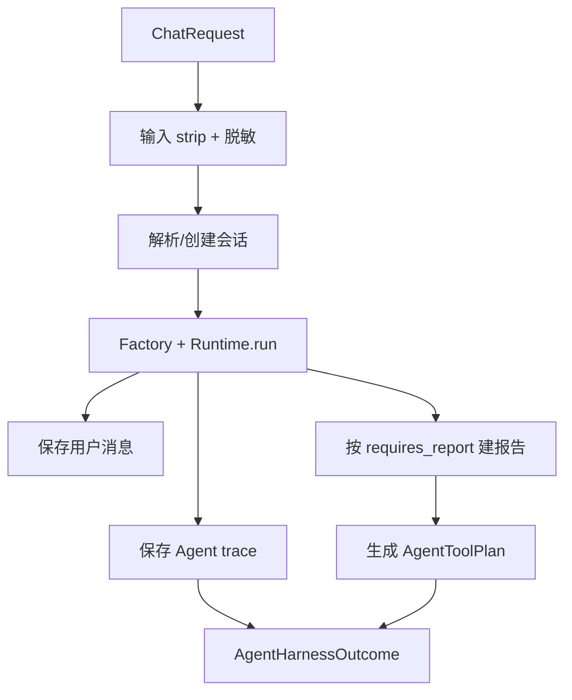

# 09｜Harness：生产单轮编排与工程验收为什么要分两层

## 1. 两个 Harness 不是同一个东西

| 名称 | 文件 | 是否生产主链路 | 职责 |
|---|---|---:|---|
| Runtime Harness | `app/agents/harness.py::MindBridgeAgentHarness` | 是 | 单轮业务编排 |
| Engineering Harness | `app/harness/runner.py` | 否 | 可重复的本地端到端验收 |

面试中先把这两个概念分开，否则容易说成“生产聊天运行在测试 Harness 里”。

## 2. Runtime Harness 做了什么

`MindBridgeAgentHarness` 是 Facade/Application Service。



### 2.1 为什么不让 Runtime 自己做这些

三种 Runtime 只关心 Agent 决策和 prompt，不应该各自重复：

- 会话权限；
- 原文/脱敏边界；
- 报告表；
- trace 表；
- 工具 Queue/MCP 选择；
- HTTP/SSE。

Harness 固定外部契约，让内部编排可替换。

### 2.2 Outcome

`AgentHarnessOutcome` 同时给 ChatService：

- session；
- original/model input；
- intent/risk/assessment；
- response messages；
- Agent steps/RAG；
- report ID；
- tool plan；
- trace ID。

ChatService 不需要再访问 Runtime 内部对象。

### 2.3 当前事务边界

Harness 每个动作独立 commit：

1. 新会话；
2. 用户消息；
3. 报告；
4. trace。

它不是 Unit of Work。中间失败会留下部分数据，但也降低长事务持锁时间。生产化可以用一个 DB transaction 覆盖会话/消息/报告/trace/outbox，再让 Redis 等派生写入最终一致。

## 3. Engineering Harness 的目标

单元测试验证函数/类；Engineering Harness 验证“把真实组件拼起来以后，核心闭环还能跑”。

它刻意使用：

```text
Mock AI
+ 临时 SQLite 文件
+ InMemoryShortTermMemoryStore
+ 关闭向量
+ log 通知
+ 本地 Excel
```

这样不依赖：

- Ollama/OpenAI；
- MySQL；
- Redis；
- Chroma；
- SMTP。

优点是离线、确定、快速；缺点是无法证明这些真实外部依赖可用。

## 4. Harness 环境如何隔离

`main()` 在 import 大部分 app 模块前先 `configure_environment()`。

它设置：

- SQLite DB path；
- AI_PROVIDER=mock；
- AGENT_FRAMEWORK=custom；
- vector disabled；
- tool queue disabled；
- alert delivery=log；
- Excel/RAG output 指向 `target/harness`。

并删除旧 SQLite、WAL、SHM 文件。

### 为什么要先设环境再 import

`app.core.database` 在 import 时立即读取 Settings 并创建 engine。如果先 import 后改环境，engine 仍指向原数据库。Harness 把业务 import 延迟到配置之后，避免误连真实 DB。

## 5. 数据库替换

`build_context()`：

1. `get_settings.cache_clear()`；
2. 重新读取 Harness 环境；
3. dispose 原 engine；
4. 建 SQLite engine；
5. 替换 `database.engine`；
6. 替换 `database.SessionLocal`。

每个 suite 前：

```text
Base.metadata.drop_all
-> create_all
-> seed_data
```

保证 suite 间数据库隔离。

## 6. Redis 替换

`InMemoryShortTermMemoryStore` 用 class-level dict 模拟：

- load_recent；
- messages_from_rows；
- append；
- replace；
- 最大条数；
- 脱敏。

`install_harness_patches()` 替换：

- `app.agents.harness.RedisShortTermMemoryStore`
- `app.agents.runtime.RedisShortTermMemoryStore`

每个 suite 前 `reset()`。

边界：它没有替换 `event_driven_runtime.py` 已导入的 Store，也没有替换 `AgentPrivateMemory` 内部动态 import 的真实 Store。但 Harness 强制使用 custom runtime，所以当前不触发。若直接把 Harness 切到 event-driven，会意外尝试真实 Redis。

## 7. 六个 Suite

### 7.1 Risk Safety Harness

场景：

- 中文高风险；
- 英文高风险；
- 低风险咨询；
- 普通 Python 问题。

验证：

- SSE meta/done；
- 有 token；
- 报告是否创建；
- risk 是否 HIGH；
- Excel/Case/Alert job 是否按规则入队；
- 学生文本不出现后台风险字段。

它临时把 tool_queue_enabled=true，但没有启动 Worker，只验证入队。

### 7.2 Agent Routing Harness

强制 custom runtime，验证：

- CHAT 运行 Memory/Supervisor/Companion；
- CONSULT/RISK 运行 Memory/Supervisor/Knowledge/Risk/Counselor；
- CHAT 不检索；
- CONSULT/RISK 有知识结果。

它不验证默认事件驱动 Runtime。

### 7.3 Standard Skills Harness

计划验证：

- 7 个 Skill；
- READY；
- 路径；
- 场景选择；
- high-risk 精确集合；
- prompt context；
- counselor handoff。

当前在 Windows path 断言失败。

### 7.4 RAG Harness

- 读取 60 条数据；
- 运行 `evaluate_case()`；
- 算 Recall/Precision/MRR/NDCG/HitRate；
- 要求 Hit/Recall >= .95，MRR/NDCG >= .75；
- 写 `rag-eval-report.json`。

因为 vector disabled，只验证 BM25 fallback。

### 7.5 API Harness

用 FastAPI TestClient 计划验证：

- health；
- profile；
- agent status/Skill path；
- admin 禁止聊天；
- student SSE；
- student 禁止管理接口；
- admin reports；
- knowledge ingest/status。

当前在 agent status Skill path 断言提前失败，所以后续 API 断言没有完成。

### 7.6 Tool Queue Harness

直接调用业务/Worker 内部方法验证：

- HIGH 生成 3 jobs；
- Alert 依赖 Case；
- Excel 幂等；
- Case 幂等；
- dependency ready；
- log alert 成功且 Case -> ALERT_SENT；
- RateLimiter；
- 最大尝试后 DEAD + DeadLetter。

它没有启动 dispatcher 做真实并发轮询，也没有验证 ToolGovernance。

## 8. 报告格式

每个 suite 经 `run_check()` 包装：

- `HarnessFailure` -> 简短 failure；
- 其他 Exception -> 类型、message、traceback；
- 不因单 suite 失败停止后续 suite。

最终写：

```text
target/harness/harness-report.json
target/harness/rag-eval-report.json
```

进程退出码：

- 全 PASS -> 0；
- 任一 FAIL -> 1。

这适合接 CI。

## 9. 当前实际结果

2026-08-02：

| Suite | 结果 | 说明 |
|---|---|---|
| Risk Safety | PASS | 4 场景 |
| Agent Routing | PASS | Custom 三类路径 |
| Standard Skills | FAIL | Windows 路径分隔符 |
| RAG | PASS | 60 条 fallback 检索 |
| API | FAIL | 同一 Skill path 断言提前失败 |
| Tool Queue | PASS | 幂等/依赖/限流/死信 |

17 个独立单元测试全部通过。Harness 失败与单测全绿并不矛盾：单测没有验证跨平台 status path。

## 10. Harness 没覆盖什么

### Runtime

- 默认 event-driven 端到端 run；
- LangGraph；
- Safety critique/revision；
- budget exhausted；
- per-Agent model；
- Agent private Redis。

### RAG

- Chroma；
- embedding API；
- vector/BM25 hybrid；
- snapshot/rebuild；
- PDF 解析；
- vector_required=true。

### Tool

- dispatcher 并发领取；
- 多实例重复执行；
- MCP client/server；
- SMTP；
- Governance 接线；
- crash recovery 的真实进程场景。

### API

- agent traces/tool audits/conversation；
- 有 report 时 `/api/admin/reports`；
- stream 中断/error SSE；
- 文件上传 PDF；
- vector rebuild/backup 成功。

### 安全

- prompt injection；
- 生成后安全审查；
- 敏感内容在 handoff/email；
- 认证爆破/权限边界；
- 日志泄露。

## 11. 一个被 Harness 提前失败遮住的问题

`ReportService` 当前类方法绑定异常：

```text
hasattr(ReportService, "agent_run_traces") == False
hasattr(ReportService, "tool_audits") == False
hasattr(ReportService, "conversation") == False
hasattr(ReportService, "_report_response") == False
```

API Harness 因 Skill path 更早失败，还没走到这些管理端点。即使修复路径断言，仍应添加对应 API case 才能暴露这些错误。

此外 `/api/admin/reports` 在数据库没有报告时不会调用缺失的 `_report_response()`，可能返回空列表并假通过；必须先创建 CONSULT/RISK 报告再测。

## 12. 为什么 Harness 值得保留

### 对 Agent 项目特别重要

Agent 系统故障通常出现在边界：

- prompt 组装；
- state 顺序；
- mock/真实 provider 差异；
- RAG 无结果；
- 报告和工具副作用；
- 流式协议；
- 隐私字段外泄。

只测单个 classifier 无法证明闭环。

### 与 E2E 的区别

Engineering Harness 是“应用进程内的可控 E2E”：

- 不启动真实浏览器；
- 不启动真实外部服务；
- 直接替换依赖；
- 快速定位 suite。

它介于 unit test 和真实部署 smoke test 之间。

## 13. 改进建议

### P0：修复跨平台断言并扩大 API case

- API path 输出统一 `.as_posix()`；
- 测试也可用 `Path` 语义而非硬编码斜杠；
- API Harness 先创建 report；
- 覆盖 report/trace/audit/conversation。

### P1：Runtime 参数化矩阵

同一套案例分别运行：

```text
custom
langgraph
event_driven_multi_agent
```

比较 intent/risk/RAG/report/安全约束，不要求 steps 完全相同。

### P1：真实服务集成层

可选 suite：

- Redis Testcontainer；
- MySQL Testcontainer；
- Chroma 临时目录 + mock embedding server；
- MCP stdio；
- SMTP capture server。

默认离线 suite 保持快，CI nightly 跑真实依赖。

### P1：故障注入

- AI complete/stream 在不同阶段失败；
- Redis read/write 失败；
- Chroma count/query/upsert 失败；
- Excel save 后 DB commit 失败；
- Worker 执行后崩溃；
- MCP structured/text/error result。

### P2：质量与性能预算

Harness 报告增加：

- 端到端 latency；
- Agent 调用次数；
- prompt tokens；
- RAG latency；
- fallback 次数；
- tool attempts；
- PII leak checks；
- 最终回复安全评分。

## 14. 面试回答模板

> 项目有两个 Harness。生产的 MindBridgeAgentHarness 是单轮应用服务，把输入脱敏、会话、可替换 Runtime、消息、报告、trace 和工具计划统一起来，让 HTTP 与三套 Runtime 解耦。工程 Harness 则是测试基础设施，在导入业务模块前把环境切到 Mock AI、SQLite、内存记忆、关闭向量和 log 通知，每个 suite 重建 DB，验证风险、路由、Skill、RAG、API 和 Tool Queue。它能离线复现完整闭环，但当前主要覆盖 Custom Runtime 和 BM25 fallback，默认事件驱动、LangGraph、Chroma、MCP 和治理接线仍需参数化集成测试。

## 15. 源码导航

- `app/agents/harness.py`
- `app/harness/runner.py`
- `tests/test_event_driven_multi_agent.py`
- `tests/test_memory_compaction.py`
- `tests/test_privacy_and_assessment.py`
- `tests/test_skills.py`
- `tests/test_tool_governance.py`

