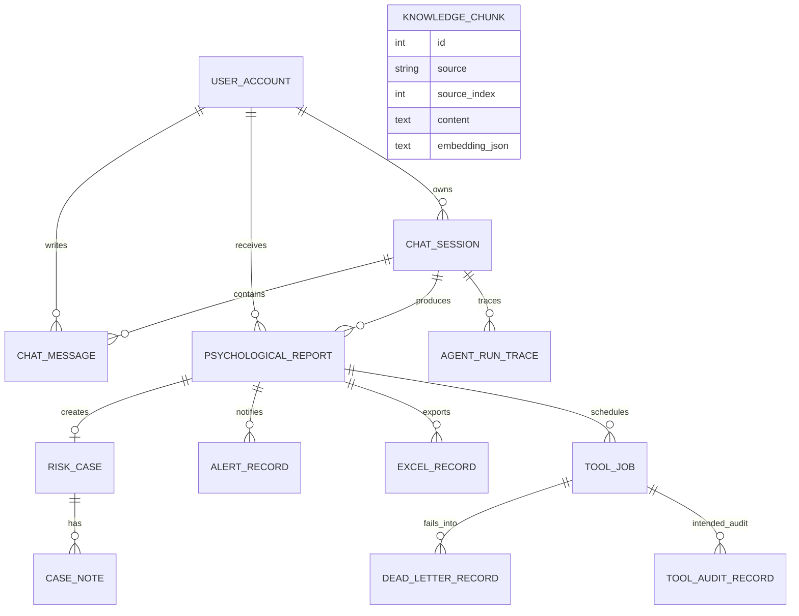
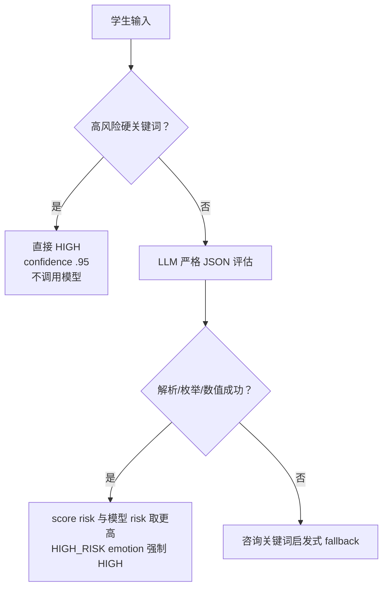

# 10｜持久化、可观测性与安全：数据模型、Trace、风险评估和权限边界

## 1. 数据模型总图



SQLAlchemy 代码没有给所有逻辑关联声明 ForeignKey。例如 RiskCase.report_id、CaseNote.case_id、ToolJob.report_id 等主要靠应用逻辑和索引维持，数据库层参照完整性较弱。

## 2. 业务实体与写入者

| 表 | 核心数据 | 写入者 | 读取者 |
|---|---|---|---|
| `user_accounts` | 账号、SHA-256、roles CSV | seed_data | Auth、报告、工具 |
| `chat_sessions` | public_id、title、user、时间 | Harness | Runtime、后台会话 |
| `chat_messages` | 原始用户/assistant 文本 | Harness | Memory fallback、后台 |
| `knowledge_chunks` | source、顺序、内容、embedding JSON | KnowledgeService | BM25、Chroma sync |
| `psychological_reports` | 原文、intent、emotion、risk、confidence、summary | Harness | 管理端、工具 |
| `risk_cases` | report、owner、status、handoff | Tools | 管理端、alert |
| `case_notes` | actor、note | Tools | 管理端 |
| `alert_records` | channel、recipient、status、message | Tools | 管理端 |
| `excel_records` | report、path、status、message | Tools | 管理端、幂等检查 |
| `tool_jobs` | kind、status、attempt、依赖、run_after | Queue | Worker、管理端 |
| `dead_letter_records` | 失败 payload/reason | Worker | 管理端 |
| `agent_run_traces` | 输入、prompt、steps、RAG、assessment | TraceService | 预期管理端 |
| `tool_audit_records` | policy/allowed/status/payload | Governance | 预期管理端 |

## 3. 会话和消息

### ChatSession

- `public_id` 是 uuid hex，对外 sessionId；
- 数据库自增 id 只在内部；
- 新会话 title 取首条原文前 36 字符；
- 复用会话时同时检查 public_id 和 user_id；
- `touch()` 更新 `updated_at`。

### ChatMessage

- role 存 `USER/ASSISTANT`；
- content 是原文；
- 关系配置 `cascade="all, delete-orphan"`，删除 Session 可级联 ORM 消息；
- 当前没有 token 数、模型、generation status、edit/delete 标记。

## 4. 报告创建语义

`AgentRunResult.requires_report`：

```text
intent != CHAT
```

`MindBridgeAgentHarness._create_report()` 还要求 `assessment is not None`。

保存：

- 原始输入；
- intent；
- emotion；
- emotion score；
- risk level；
- confidence；
- summary。

报告在最终 assistant 文本生成前 commit。它是后台评估记录，不向学生 prompt 输出 risk 分数。

### `AgentHarnessOutcome.risk_level` 的语义细节

Outcome 中的 risk_level 不是无条件复制 Runtime risk，而是：

```text
report.risk_level if report exists else None
```

因此 CHAT 即使 Runtime risk 是 LOW，Outcome risk_level 也是 None。Engineering Harness 的 normal-chat 结果也显示 null。字段名容易让调用方误以为它总是“Runtime 风险等级”。

## 5. Agent Trace

`AgentRunTrace` 保存一轮生成前快照。

### 5.1 标量字段

- user_id/session_id/report_id；
- intent/risk；
- original_input；
- sanitized_input；
- memory_brief；
- created_at。

### 5.2 JSON Text 字段

| 字段 | 内容 |
|---|---|
| `agent_steps_json` | AgentStep；事件驱动还追加 events/tasks/artifacts |
| `retrieved_knowledge_json` | SearchResult |
| `response_messages_json` | 最终流式调用使用的 prompt messages |
| `assessment_json` | PsychologyAssessment |

`_to_jsonable()` 支持 Enum、dataclass、Pydantic model、list/tuple/dict，最后 `json.dumps(..., default=str)`。

### 5.3 Trace 的价值

- 还原为何路由到 CONSULT/RISK；
- 查看执行过哪些 Agent；
- 查看 RAG 召回；
- 查看模型前 prompt；
- 查看事件驱动任务和 artifact；
- 关联 report。

### 5.4 Trace 不是 observability 全部

缺失：

- run/turn correlation ID 对外字段；
- provider/model profile 快照；
- 各 Agent LLM 请求/响应；
- token/成本；
- latency；
- exception/status；
- final assistant text；
- tool job/result；
- trace schema version。

而且 `original_input` 与 response prompt 可能含敏感数据，管理端权限和保留周期需要严格控制。

## 6. 管理读取层的当前问题

`ReportService` 预期把 ORM 转 DTO，并限制最近 100 条。但当前源码缩进导致：

- `agent_run_traces` 在类外；
- `tool_audits` 在类外；
- `conversation` 嵌套在 module-level `tool_audits` 内；
- `_report_response` 同样没有绑定到类。

本地反射确认这些方法不在 `ReportService` 上。

影响：

- `/api/admin/agent-traces`；
- `/api/admin/tool-audits`；
- `/api/admin/conversations/{session}`；
- 有报告时的 `/api/admin/reports`；
- `/api/reports/me`。

空报告列表可能掩盖 `_report_response` 缺失，因为列表推导不会调用它。

## 7. 风险评估的三层防线



### 7.1 硬规则

中英文关键词包括自杀、自残、不想活、结束生命等。命中后不调用 LLM，单元测试用会抛异常的 AI 验证了这一点。

优点：明确危机不依赖模型格式/可用性。

缺点：

- 关键词有限；
- 否定、引用、讨论新闻也可能误报；
- 委婉表达可能漏报；
- 没有上下文实体/时态分析。

### 7.2 LLM JSON

模型被要求返回：

```json
{
  "emotion": "NORMAL|ANXIETY|DEPRESSED|HIGH_RISK",
  "emotionScore": 0.0,
  "risk": "LOW|MEDIUM|HIGH",
  "confidence": 0.0,
  "summary": "..."
}
```

解析允许模型前后有文本：取第一个 `{` 到最后一个 `}`。然后：

- Enum 转换；
- float；
- confidence clamp 到 0..1；
- 根据 score 计算 risk；
- score risk 比模型 risk 高时升级；
- HIGH_RISK emotion 强制 HIGH。

任何异常都进入 heuristic，不会把 parser error 向上暴露。

### 7.3 Heuristic

- 命中咨询词；
- 低落类关键词 -> DEPRESSED、score 3.1、MEDIUM；
- 其他咨询 -> ANXIETY、score 2.2、LOW；
- 无信号 -> NORMAL/LOW。

这是可用性 fallback，不是临床模型。

## 8. 学生可见信息隔离

Prompt 明确禁止输出：

- 风险等级；
- 后台报告分数；
- 诊断；
- 报告口吻；
- medication advice。

Risk Safety Harness 还检查回复不含：

```text
风险等级
报告ID
emotionScore
HIGH_RISK
```

但是这是字符串黑名单，不能证明所有后台元数据都不会被模型换一种说法泄露。

## 9. 隐私

### 已实现

- 手机号、邮箱、身份证格式脱敏；
- 模型输入用 sanitized_input；
- Redis 写脱敏内容；
- trace 同时保存 original/sanitized，便于审计差异；
- Excel 不写完整原文。

### 敏感面

- MySQL 消息/报告保存原文；
- Trace 保存原文；
- RiskCase handoff 包含最多 700 字原始表达；
- 邮件正文包含 handoff；
- 管理 API 可读完整会话；
- Basic Auth token 存前端 sessionStorage；
- 日志异常可能包含外部服务 message；
- 现有旧架构文档包含本地连接敏感值，不应继续扩散。

### 缺失

- 字段级加密；
- 数据保留/删除策略；
- 用户导出/遗忘权；
- 管理访问审计；
- PII NER；
- 最小权限；
- 租户隔离；
- 邮件内容分级；
- secret manager。

## 10. 认证与授权

### 当前

- Basic Auth；
- 密码 SHA-256；
- roles 逗号字符串；
- student/admin 角色；
- route dependency 做权限。

### 风险

- SHA-256 太快，数据库泄露后易离线爆破；
- 默认弱口令种子；
- Basic token 每次请求发送；
- 无 HTTPS 强制；
- 无失败限流/MFA；
- 无 token 撤销；
- 管理员审计不足。

只适合本地 Demo。

## 11. 工具与安全

高风险规则确定性地产生：

```text
PsychologicalReport
-> Excel
-> RiskCase
-> Alert
```

但：

- 工具治理未接线；
- Agent tool_permissions 未强制；
- SMTP/log 结果与 Agent trace 未关联；
- 工具失败对学生静默；
- 多实例 Queue 可能重复执行。

心理危机场景需要“可恢复 + 可审计 + 确认送达”，当前已有骨架但还没达到生产闭环。

## 12. 数据一致性

### MySQL 内

多个方法各自 commit，没有一个涵盖整轮的事务。

### MySQL 与 Redis

MySQL 先 commit，Redis append 后执行且异常被吞。因此 MySQL 是事实源，Redis 是可能缺失的缓存。

### MySQL 与 Chroma

跨存储无事务；required=false 偏向保证文本可用，向量可稍后修复。

### MySQL 与 Excel/SMTP

ToolJob 提供最终一致和重试，但 Excel 文件写与 ExcelRecord commit 之间仍有断点；SMTP 是否真正送达也只依据 send_message 不抛异常。

## 13. 部署与配置边界

- `Settings` 读取 `.env`，extra=ignore；
- 当前没有配置 schema 分组或敏感字段专门类型；
- Docker Compose 中存在环境特定的外部连接默认值和与项目名不一致的数据库默认，属于高风险配置漂移；
- Docker 默认 Runtime 与代码默认不同；
- Dockerfile 只复制 app 和 Modelfile，没有复制 `skills` 与 `app/knowledge` 之外的模型权重；其中 `app/knowledge` 随 app 被复制，但根目录 `skills` 没复制，容器内 Skill Registry 会找不到标准 Skill；
- Dockerfile 也没复制前端外的根目录 skills，因此 `/api/agent/status` 可能返回空 Skill，咨询 prompt 会在 `get_required()` 抛错。

最后一点是重要部署缺口：Skill root 在项目根 `skills`，而 Dockerfile 只 `COPY app ./app` 和 Modelfile。

## 14. 可观测性成熟度

| 能力 | 当前 |
|---|---|
| Python logging | 有 warning/exception |
| DB Agent trace | 有生成前快照 |
| Tool job state | 有 |
| Dead letter | 有 |
| Tool audit | 结构有，未接线 |
| Metrics | RAG 离线指标；无运行时 metrics |
| Distributed trace | 无 |
| LLM token/cost | 无 |
| Alert delivery receipt | 无 |
| Health | 只返回 UP，不检查 DB/Redis/AI/Chroma/Worker |

`/actuator/health` 无条件返回 `{"status":"UP"}`，不能代表依赖健康。

## 15. 改进优先级

### P0

- 修 ReportService 方法绑定；
- 工具治理接线；
- HIGH 最终输出安全 gate；
- Docker 复制 Skill 并清理外部连接默认；
- 更换密码哈希与 secret 管理；
- 健康检查至少区分 liveness/readiness。

### P1

- 一轮 DB transaction + outbox；
- trace 加 status/latency/model/final output；
- 管理访问审计；
- PII 分级与保留策略；
- Alembic；
- Worker 多实例可靠领取。

### P2

- OpenTelemetry；
- 模型成本预算；
- 完整风险运营 SLA；
- 告警 ack/升级链；
- 加密与隐私治理。

## 16. 面试回答模板

> MySQL 保存业务事实：会话、原始消息、心理报告、个案、工具任务和 Agent trace；Redis 只做脱敏短期记忆，Chroma 与 Excel 是派生存储。风险评估有硬关键词、LLM JSON 和 heuristic 三层，模型 risk 还会被 score 和 HIGH_RISK emotion 向上校正。学生 prompt 明确隔离后台标签，高风险副作用放入可重试 ToolJob。但当前可观测性仍是 Demo 到原型阶段：trace 记录生成前 prompt 而非最终文本，health 不检查依赖，ToolAudit 未接线，Basic Auth/SHA-256 和 Docker 配置也不适合生产。

## 17. 源码导航

- `app/models/entities.py`
- `app/services/trace.py`
- `app/services/report.py`
- `app/services/assessment.py`
- `app/services/privacy.py`
- `app/core/security.py`
- `app/core/database.py`
- `app/core/bootstrap.py`
- `Dockerfile`
- `docker-compose.yml`

