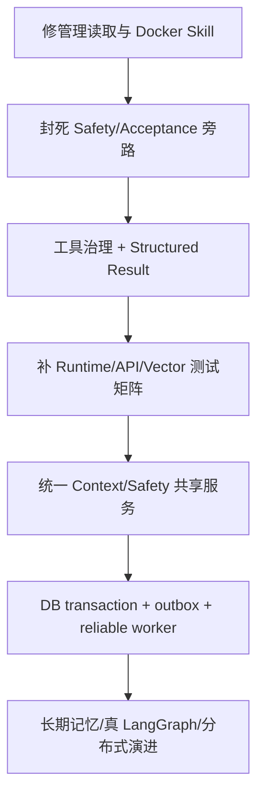

# 11｜已证实缺口与改进路线：哪些是问题，哪些只是建议

## 1. 证据分类

本篇区分：

- **运行复现**：执行测试/Harness 得到失败。
- **结构确认**：通过源码调用点和 Python 反射确认未接线/绑定错误。
- **设计风险**：当前规模可能不触发，但生产部署会暴露。
- **演进建议**：不是 bug。

## 2. P0：正确性与安全边界

### 2.1 ReportService 方法没有绑定到类

证据：结构确认 + Python 反射。

```text
ReportService.agent_run_traces -> 不存在
ReportService.tool_audits      -> 不存在
ReportService.conversation     -> 不存在
ReportService._report_response -> 不存在
```

影响：

- 三个管理端点直接 AttributeError；
- 有报告时 latest_reports 失败；
- 学生“我的报告”也可能失败；
- 管理前端打开会话档案失败。

为什么现有 Harness 没完整暴露：

- API Harness 先在 Skill path 断言失败；
- admin reports 当时可能为空，列表推导没有调用 `_report_response`。

改进：

- 修正缩进；
- 单元测试 `hasattr`/DTO 转换；
- API Harness 先创建 CONSULT 报告，再测所有 endpoint；
- 增加空/非空两种 case。

### 2.2 事件驱动预算耗尽可使用未批准 Proposal

证据：结构确认。

Coordinator 只有 Safety review 通过才设置 final artifact，但 Runtime 适配使用：

```text
accepted_artifact OR latest response_proposal
```

影响：在 revision 卡住或预算不足时，未批准 prompt 仍可能进入最终生成。

改进：

- HIGH/CONSULT 都只使用 accepted；
- 没有 accepted 时确定性 fallback；
- 输出结果带 `accepted=false/budget_exhausted`；
- 增加对应测试。

### 2.3 Safety 审查的不是最终文本

证据：端到端调用链。

SafetyAgent 审查 `response_proposal.messages`；最终文本在 Runtime 结束后由 ChatService 的全局 AiClient 生成。

影响：模型偏离 prompt 时无生成后 gate。

改进选择：

1. Runtime 内生成完整 candidate，再审查后流式回放；
2. 双模型/规则对流式分块审查；
3. 先生成到 buffer，审查后再流；
4. 高风险使用受控模板 + 有限生成。

心理危机场景应优先安全，允许牺牲部分首 token 延迟。

### 2.4 Tool Governance 未接线

证据：结构确认；`rg` 只有 import，没有调用。

影响：

- policy 不阻断真实 job；
- tool_audit_records 不写；
- tool_permissions 不执行。

改进：Queue 与 MCP 共用授权执行器，审计所有 allowed/blocked/success/failed。

### 2.5 Docker 构建缺少根目录 Skills

证据：Dockerfile 只复制 `app` 和 Modelfile，而 Skill root 是项目根 `skills`。

影响：

- 容器内 status skills 为空；
- CONSULT/HIGH 在 `get_required()` 时可能抛；
- 本机与容器行为不同。

改进：复制 Skills，构建时运行 Skill validation/smoke test。

### 2.6 Docker 连接默认存在环境漂移

证据：配置文件静态检查。

Compose 中含环境特定的外部 DB/Redis 默认，数据库名还与本项目不一致；同时 Runtime 默认覆盖为 LangGraph。

影响：误连外部环境、数据污染、泄密、行为与本地不同。

改进：

- 默认只指向 compose service；
- 所有密码通过 secret/env 显式提供；
- 无值时 fail fast；
- 开发/生产 compose 分离；
- 不在文档复制真实连接细节。

## 3. P1：可用性、测试与一致性

### 3.1 Windows Skill path 使两个 Harness 失败

证据：运行复现。

实现输出反斜杠，Harness 只接受 `/SKILL.md`。Standard Skills 与 API 均 FAIL。

改进：

- API 输出 `.as_posix()`；
- 测试用 Path 语义；
- 跨 Windows/Linux CI。

### 3.2 默认事件驱动 CHAT 不加载会话历史

证据：Coordinator gating 和 ContextAgent 调用链。

影响：普通多轮问答连续性不如 Custom/LangGraph。

改进：为 CHAT 创建 lightweight memory context，不做 RAG/Skill。

### 3.3 事件驱动风险评估通常早于历史 Context

证据：任务优先级/claim confidence 和派生依赖。

影响：跨轮升级信号可能被忽略。

改进：

- 给 SafetyAgent 独立读取受控近期安全上下文；
- 或先创建轻量 memory artifact，再做 risk；
- hard rule 仍直接 override。

### 3.4 Revision 不消费 Critique

证据：ResponseAgent.act 不读取 critique payload。

影响：修订可能重复生成相同 proposal，浪费 budget。

改进：把 critique reason 和 previous proposal 明确加入 revision prompt。

### 3.5 Tool Queue 多实例领取不原子

证据：先 select PENDING，再逐个 update RUNNING。

影响：横向扩容重复执行。

改进：数据库 row lock/skip locked、lease、heartbeat、幂等键。

### 3.6 MCP 结果协议是脆弱字符串

证据：`caseId=(\d+)` 正则。

影响：文案变更导致高风险 alert 不发送，且没有 dead letter。

改进：structuredContent + 明确业务错误。

### 3.7 RAG Harness 没测向量主路径

证据：Harness 强制 vector disabled。

影响：当前指标只能说明 BM25 fallback。

改进：新增 mock embedding/临时 Chroma suite，做 ablation。

### 3.8 Trace 没有最终文本和执行状态

证据：保存时序和表字段。

影响：无法把 Agent 决策与真实用户回复、模型失败、工具结果闭合。

改进：Run 表增加 lifecycle status；流结束补写 generation/tool fields，或拆 span 表。

### 3.9 Trace 中事件重复

证据：先 events -> steps，保存时又追加 raw events。

影响：数据冗余、消费者 schema 复杂。

改进：steps 与 collaboration events 分字段，带 schema version。

### 3.10 跨存储事务缺失

MySQL/Redis/Chroma/Excel/SMTP 都是分步写。当前选择“可用优先 + 最终一致”，但没有 reconciliation job。

改进：

- MySQL transaction + outbox；
- Redis 视为 cache；
- Chroma generation/rebuild；
- Excel/Alert reconcile；
- 状态 dashboard。

## 4. P1：部署和工程

### 4.1 没有 Alembic

`create_all` 不修改已有表。实体演进可能与 DB schema 漂移。

### 4.2 健康检查永远 UP

无法反映 DB、Redis、AI、Chroma、Worker。应拆 liveness/readiness/dependency status。

### 4.3 旧架构文档包含本地敏感连接信息

现有 `docs/project-architecture.md` 记录了本地连接细节。即使不提交，也不应继续传播；建议用占位符重写并检查历史。

### 4.4 少量中文编码污染

例如配置中的 alert subject prefix 存在 mojibake，memory 文件还有问号注释。会影响通知文案和维护可读性。应统一 UTF-8 并加编码检查。

### 4.5 配置声明不完整

AgentModelRegistry 尝试读取 per-Agent temperature/max_tokens，但 Settings 没声明对应字段且 extra=ignore。provider/model 可配，温度/token 的按 Agent 覆盖难以通过环境生效。

## 5. P2：能力演进

### 5.1 长期语义记忆

当前 MySQL 是归档。可增加结构化事实/episodic memory，但必须有来源、置信度、冲突和删除。

### 5.2 token-aware Context

替代条数裁剪，统一三种 Runtime。

### 5.3 Skill 真正渐进式披露

Catalog、正文、references、assets 分级加载，增加缓存和声明式触发。

### 5.4 LangGraph 持久能力

若保留 LangGraph，使用 checkpointer、thread_id、interrupt 和恢复；否则其收益有限。

### 5.5 分布式工具执行

达到多实例规模后再引入成熟 Queue 或可靠 DB Worker，不必过早上 Kafka。

## 6. 建议实施顺序



### 第一阶段：让现有能力真实可用

- ReportService；
- Docker Skills；
- path；
- acceptance；
- final safety；
- governance。

### 第二阶段：建立可验证基线

- 三 Runtime conformance；
- API 全路由；
- Chroma/MCP/Redis/MySQL 集成；
- failure injection。

### 第三阶段：再做架构增强

- 统一 ContextBuilder；
- outbox；
- observability；
- 长期记忆；
- LangGraph checkpoint。

## 7. 怎样在面试中讲“不足”

不要说“这个项目很多 bug”。用以下结构：

> 当前实现选择了 X，以换取 Y；在单实例 Demo 下成立，但扩展到 Z 时会暴露 A 风险。我已经通过 B 证据确认边界，优先会用 C 改进，并用 D 测试验证。

示例：

> 工具队列用 MySQL 任务表和线程池，优点是依赖少、失败可恢复；但领取不是原子操作，多实例可能重复。我会用 skip-locked/lease 和业务幂等键解决，并做两 Worker 并发领取测试。

## 8. 面试官最看重的诚实边界

这些不能夸大：

- 不是分布式 Actor；
- 不是模型自主 tool calling；
- Tool governance 尚未生效；
- LangGraph 没用 checkpoint；
- 长期语义记忆没做；
- RAG 分数没覆盖向量主路径；
- Skill 只是粗粒度渐进披露；
- final safety review 不覆盖实际生成文本。

能准确说出这些，反而能体现你真的读过源码。

