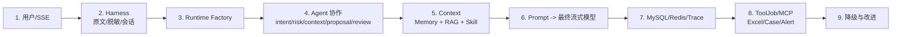

# 12｜面试手册：项目口述、源码追问、设计取舍与改进回答

## 1. 你要传达的核心形象

面试官真正想判断的不是你记住了多少类名，而是你能否：

- 还原一次 Agent run 的数据与控制流；
- 区分模型决策、业务规则与外部副作用；
- 解释安全、可用性、成本和复杂度取舍；
- 说清降级、幂等、重试和审计；
- 诚实识别“有代码结构”和“真正接入”之间的差别；
- 提出有优先级、能验证的改进。

## 2. 30 秒版本

> MindBridge 是一个校园心理陪伴与风险预警 Agent 应用。它基于 FastAPI 提供 SSE 聊天，先脱敏用户输入，再通过可替换 Runtime 做意图、风险、记忆、RAG 和 Skill 编排，最后由模型流式生成回复。咨询和风险场景会保存心理报告与 Agent trace，并在回复后通过数据库任务队列或 MCP 执行 Excel、风险个案和预警。默认源码 Runtime 是事件驱动黑板协作，同时保留 LangGraph 和普通自研循环。

## 3. 1 分钟版本

> 请求进入后不是直接调用模型。MindBridgeAgentHarness 先解析会话和脱敏，再由 Factory 根据配置选择事件驱动、LangGraph 或 Custom Runtime。默认事件驱动模式让 Understanding、Safety、Context、Response 四个 Agent 围绕 append-style Blackboard 协作，Coordinator 根据缺失 artifact 创建任务，Agent 按 capability 和 confidence claim，最终 proposal 必须经过 Safety review 才采纳。咨询或风险路径会从 Redis 读短期记忆，Redis miss 从 MySQL 最近消息回填，再做 RAG 混合召回和 Skill 注入。Runtime 返回的是 prompt messages，外层 AiClient 再做 SSE 流式生成。报告与 trace 落 MySQL，Excel、Case、Alert 通过 ToolJob 后台执行，有依赖、重试、限流和死信。当前我识别的主要缺口是最终文本没有被 SafetyAgent 真正审查、ToolGovernance 未接线、LangGraph 没有 checkpoint，以及向量主路径缺集成评测。

## 4. 5 分钟版本

### 4.1 架构

> 我把项目分四层：HTTP/SSE、单轮业务 Harness、智能 Runtime、持久化与后台工具。路由只做认证和响应类型；Harness 统一三种 Runtime 的外部契约；Runtime 负责意图、风险、上下文和 prompt；MySQL、Redis、Chroma 和 Tool Queue 负责数据闭环。

### 4.2 一轮请求

> Harness 保留 original_input，同时把手机号、邮箱、身份证脱敏成 model_input。它先解析 session，再运行 Runtime；Runtime 返回后保存用户消息、需要时建 PsychologicalReport，并把 steps、RAG、assessment 和 prompt 写 AgentRunTrace。ChatService 先发 meta，再流 token，完整结束后保存 assistant，最后派发工具，工具失败只记日志不影响 done。

### 4.3 Agent

> 默认事件驱动模式用 Task、Message、Artifact 和 Event 建黑板。Coordinator 根据缺 intent/risk/context/response/review 动态建任务。Understanding 和 Safety 可以独立处理当前输入；支持路径再由 Context 组合 Memory、RAG、Skill；Response 产出 prompt proposal；Safety 绑定 proposal ID 做 review；Coordinator检查 review 和 confidence 后采纳。它是事件语义的同步 Runtime，不是真分布式 Actor。

### 4.4 RAG 与 Memory

> 记忆分 MySQL 完整归档、Redis 短期窗口、Agent 私有 Redis 和单轮工作记忆。Redis miss 从 MySQL 最近消息回填；超过条数阈值后用确定性摘要加最近消息，LLM 摘要失败会 fallback。RAG 按 512 字符、64 overlap 切片，向量和 BM25 各取候选，归一融合后用本地词法特征重排，再扩展第一名相邻块；向量不可用时自动变成 BM25 fallback。

### 4.5 工具与改进

> 工具选择不是模型自主 function calling，而是风险等级决定 Excel、Case、Alert。默认写 ToolJob，Worker 有依赖、线程池、限流、线性重试和死信；队列关闭时才走 stdio MCP。业务结果分别写 ExcelRecord、RiskCase 和 AlertRecord。当前治理类和审计表存在但没接到 Worker，我会优先接入并把字符串 caseId 解析改为 structured result。

## 5. 15 分钟白板顺序

建议时间：

| 内容 | 时间 |
|---|---:|
| 场景和目标 | 1 分钟 |
| 分层架构 | 2 分钟 |
| 一轮请求 | 3 分钟 |
| 多 Agent | 3 分钟 |
| Memory/RAG/Skill | 3 分钟 |
| 工具/Harness | 2 分钟 |
| 缺口与改进 | 1 分钟 |

## 6. 工具调用高频追问

### Q1：工具怎么注册？

> `app/mcp_tools/server.py` 创建 FastMCP 实例，用 `@mcp.tool()` 装饰普通 Python 函数，函数类型注解和 docstring 形成 schema。当前六个工具覆盖 Excel、个案创建、预警、确认和备注。

继续追问：

> 主聊天默认不经 MCP，而是 ToolJob Queue；MCP 是队列关闭时的兼容路径，两条路径复用 ToolOrchestrationService。

### Q2：工具是模型自己选的吗？

> 不是。Runtime 得到 intent/risk 后，Harness 只生成 report_id/risk_level 计划；规则固定决定 Excel、MEDIUM/HIGH Case、HIGH Alert。它不解析模型 tool_calls，也不把结果回填模型。

### Q3：工具结果存哪里？

> 调度状态在 tool_jobs；Excel 业务结果在 excel_records 并写 xlsx；个案在 risk_cases；通知每次结果在 alert_records；超过最大尝试在 dead_letter_records。MCP response 字符串本身不持久化，ChatService 也忽略返回列表。

### Q4：工具调用结果解析失败怎么办？

> MCP client 先拼接 result.content 文本，再用 `caseId=(\d+)` 正则解析。HIGH 下解析失败会抛 McpToolError，alert 不发送；ChatService 只记 warning，仍给学生 done。MCP 路径没有 retry/dead letter，所以这是结构化结果应优先改造的原因。

### Q5：Queue 怎么重试？

> 执行前 attempts+1；失败且未达 max 时回到 PENDING，run_after 是 retry_delay×attempts；达上限变 DEAD 并写 DeadLetterRecord。依赖等待和限流 requeue 不增加 attempts。

### Q6：幂等怎么做？

> 入队按 report+kind 复用活跃/成功 job；Excel 先查同 report SUCCESS record；Case 先查 report 且 DB 有 unique；Alert 先查同 report SUCCESS。仍有 Excel 文件写成功、DB commit 失败导致重复行的窗口。

### Q7：工具治理呢？

> Policy、GovernanceService、ToolAuditRecord 和单测都存在，但 Worker/MCP 没调用，所以当前未生效。我不会把它说成已完成能力。

## 7. Memory 与上下文追问

### Q1：短期、长期、工作记忆分别是什么？

> 短期是 Redis List；长期是 MySQL 完整聊天归档，但不是语义记忆；工作记忆在 Custom/LangGraph 是 AgentContext，在事件驱动是 Blackboard；事件驱动还有按 Agent 隔离的 Redis 私有短期日志。

### Q2：Redis key 和 value？

> 会话 key 是 `mindbridge:short-term-memory:{session}`；Agent 私有实际 key 再包含 `agent:{AgentName}:{session}`。每项 JSON 有 role、脱敏 content、createdAt。

### Q3：Redis 挂了怎么办？

> 初始化 ping 失败后 client=None，load 返回空；上层从 MySQL 最近消息回填。append/replace 失败只 warning，MySQL 不回滚，Redis 被视为可丢缓存。

### Q4：什么时候压缩？

> 开启 compaction 且历史消息数超过 recent_messages。生成确定性 brief，prompt 变成一条内部 system 摘要加最近 N 条。之后还尝试 LLM 摘要，失败用 deterministic brief。

### Q5：按 token 压缩吗？

> 不是，按消息数和字符上限；这是缺口。模型窗口不同、Skill/RAG 大小时不能精确保证不超限。

### Q6：摘要会持久化吗？

> memory_brief 写入 AgentRunTrace，但没有独立长期 summary record；下一轮仍主要从 Redis/MySQL 原消息重新摘要。

### Q7：普通聊天会用历史吗？

> Custom/LangGraph 会；默认事件驱动 CHAT+LOW 不建 Context task，所以不读普通会话历史，只能看到当前输入和 ResponseAgent 私有记忆。这是三 Runtime 行为差异。

### Q8：为什么 Runtime 前不先保存当前消息？

> 防止历史加载重复当前消息。Runtime 显式收到 current model_input 并追加到 model_history；返回后再持久化，供下一轮读取。代价是 Runtime 失败时用户消息不落库。

## 8. RAG 追问

### Q1：怎样切片？

> 全部空白归一后按 512 字符、64 overlap 的滑动窗口，不是 token/语义切片。简单稳定，但丢 Markdown 结构，overlap 配置不当会产生大量重复。

### Q2：怎样检索？

> 向量和 BM25 各取 candidate_k；各自 min-max；按默认 .65/.35 融合；本地 rerank 组合 fused、token cosine、coverage 和 phrase；取 top_k；第一名再拼前后邻块。

### Q3：中文 BM25 怎么 tokenize？

> ASCII 连续词 + 中文单字 + 中文相邻二元 gram，不依赖分词器。

### Q4：reranker 是什么模型？

> 不是模型，是确定性词法 reranker。不能说成 cross-encoder。

### Q5：什么时候降级？

> vector disabled、缺 API Key、缺 chromadb、embedding/query 异常且 vector_required=false 时，向量候选为空，融合自动只用 BM25。required=true 则暴露错误。

### Q6：索引怎么同步？

> query 前检查 Chroma count、DB embedding 是否齐全、ID 集是否完全一致；不满足就补 embedding、删 stale、全量 upsert 并 snapshot。

### Q7：评测结果代表什么？

> 60 条数据上 Hit/Recall .9667、MRR .9083、NDCG .9053，但 Harness 关闭向量，所以只证明 BM25 fallback，不证明 Chroma hybrid 主路径。

### Q8：为什么混合检索？

> 风险术语和校园规则常需要精确关键词，用户表述又有语义改写；向量提高语义召回，BM25 保留精确词，融合降低单路失效。

## 9. Skill 追问

### Q1：Skill 怎么加载？

> Registry 扫描单层子目录的 SKILL.md，手写解析 `---` frontmatter，要求 name/description/body，并检查 Workflow、目录名、description 和 handoff 模板。

### Q2：怎么选？

> CHAT 不选；HIGH 固定 baseline+safety；其他 CONSULT/RISK 固定 baseline+referral，再用焦虑/睡眠/学业关键词追加。

### Q3：做渐进式披露了吗？

> Prompt 层做了选择性正文注入，是粗粒度渐进披露；但 get_required 会重复扫描全部文件，没有 catalog→正文→references/assets 多级加载、缓存和 token 预算，所以不是完整实现。

### Q4：Skill 与 Tool 区别？

> Skill 是 prompt/模板规则，无副作用；Tool 执行外部业务动作。

### Q5：Skill 失败怎么办？

> response path 用 get_required，缺必需 Skill 会抛并中断 Runtime；status endpoint 能逐文件标 FAILED，但没有 runtime fallback baseline。

## 10. 多 Agent 追问

### Q1：真的事件驱动吗？

> 协议是事件驱动/Actor 风格：Task、Claim、Artifact、Event、mailbox view、Coordinator；但执行是同步 for-loop，没有异步队列或真并行。准确叫“事件建模的单进程同步多 Agent”。

### Q2：任务怎么流转？

> OPEN 任务由 Agent decide claim，Coordinator更新 CLAIMED，Agent act 返回 artifact/message/follow-up task/event，apply_turn_result 通常关闭任务；未 close 可 reopen。BLOCKED/depends_on/RELEASED 当前尚未真正使用。

### Q3：怎么选 Agent？

> 先 capability 子集过滤，再让 Agent decide 输出 claim/confidence/reason，Coordinator按 task priority、confidence、agent name 排序，并受每轮和每 Agent claim budget 控制。

### Q4：Agent 怎么通信？

> 主要通过 append-only artifact 共享；Message 会追加到共享 tuple，并可按 recipient 过滤，但当前行为很少由 message 驱动。

### Q5：Safety Override 是什么？

> SafetyAgent 评到 HIGH 发布 SAFETY_OVERRIDE；最终 intent 强制 RISK、risk 强制 HIGH，任务优先级和 prompt 进入危机模式。

### Q6：最终怎么采纳？

> 最新 response proposal 必须有绑定它 ID 的 approved safety_review，且 proposal confidence 达阈值，Coordinator 才设置 final_artifact_id。

### Q7：Revision 怎么做？

> reject 会生成 critique 和 revision task，但 ResponseAgent 当前没读取 critique reason，修订闭环不完整。

### Q8：预算耗尽呢？

> Board 记录 BUDGET_EXHAUSTED，但适配层会退到 latest proposal，即使没 accepted，这是需封死的安全缺口。

### Q9：Agent 隔离有哪些？

> 独立 system prompt、provider/model profile、Redis key、Profile tool permissions；最后一项当前只元数据，没有执行校验。

### Q10：为什么不用一个 Agent？

> 分离理解、安全、上下文和回复，使高风险判断独立、artifact 可审计、不同模型可配置；代价是延迟、状态复杂和多次模型调用。当前固定业务其实一个受控 workflow 也能实现，因此多 Agent 的主要收益是安全审查和解释性。

## 11. LangGraph 与 Custom 追问

### Q1：LangGraph state 是什么？

> GraphState 只有一个 context key，里面是可变 AgentContext；节点原地调用 Custom Runtime 的 agent 方法。

### Q2：图怎么走？

> controller conditional edge 根据 memory_loaded、intent_routed、knowledge_handled、risk_assessed、response_planned 选下一节点，每个业务节点再回 controller。

### Q3：用了 checkpoint 吗？

> 没有 checkpointer/thread_id/interrupt，因此不能持久恢复。它目前主要把有限状态机图形化。

### Q4：LangGraph 不可用怎么降级？

> Factory 用 find_spec；请求 langgraph 但模块不可 import 时选 Custom。graph build/invoke 运行时报错不会自动 fallback。

### Q5：Custom loop 怎么保证一步一个 Agent？

> 每个 outer step 扫固定列表，第一个返回 true 的 Agent执行后 break；CHAT 通常 3 step，支持路径 5 step，最多 8。

### Q6：三者语义一样吗？

> 输出契约一样，行为不完全一样，尤其会话记忆、风险上下文、Safety review、per-Agent model 和 trace。

## 12. Harness 追问

### Q1：为什么需要 Runtime Harness？

> 把会话、脱敏、三种 Runtime、消息、报告、trace、工具计划集中，HTTP 和 Runtime 都保持单一职责。

### Q2：Engineering Harness 怎么隔离外部依赖？

> 在业务 import 前设 Mock/SQLite/vector-off/log env，重建 engine，monkeypatch Redis Store 为内存实现，每 suite drop/create/seed DB。

### Q3：有哪些 suite？

> Risk、Routing、Skills、RAG、API、Tool Queue。

### Q4：当前结果？

> 17 单测全过；6 Harness 中 Risk/Routing/RAG/Tool Queue 过，Skills/API 因 Windows path 断言失败。

### Q5：Harness 最大缺口？

> 强制 Custom 和 vector-off，所以没覆盖默认事件驱动、LangGraph、Chroma、MCP、SMTP 和真实 Governance。

## 13. 安全与隐私追问

### Q1：风险 JSON 解析失败怎么办？

> 整个 parse/enum/float 异常进入 heuristic。明确高风险词在模型前直接 HIGH。

### Q2：怎样不泄露后台标签？

> system prompt 禁止，Harness 检查常见字段。但这是软约束+字符串测试，最好增加生成后 policy classifier。

### Q3：脱敏覆盖什么？

> 手机、邮箱、18 位身份证。姓名、学号、地址等未覆盖。

### Q4：哪些地方还有原文？

> MySQL消息、报告、trace original、handoff excerpt、邮件。Redis和模型输入主要脱敏。

### Q5：认证可生产吗？

> 不可。Basic Auth + SHA-256 + 默认口令只适合 Demo，需要 Argon2/bcrypt、HTTPS、密钥/令牌管理、限流、MFA 和审计。

## 14. 工程与并发追问

### Q1：Queue 多实例安全吗？

> 不安全。select PENDING 后 update RUNNING 不是原子 claim，需 row lock/skip locked 或 lease。

### Q2：Excel 为什么有锁？

> openpyxl 文件写不是并发安全；全局 threading.Lock 串行化本进程写入。跨进程仍不安全。

### Q3：Redis 与 MySQL 一致吗？

> 不强一致。MySQL 先 commit，Redis 异常只 warning；把 Redis 当可重建 cache。

### Q4：Chroma 与 MySQL 呢？

> 无跨存储事务，query 前做 count/ID/embedding 检查并全量 sync 自愈。

### Q5：为什么工具放回复后？

> 降低学生首屏和完整回复等待，避免 SMTP/Excel 阻塞；代价是工具失败对学生不可见，需要后台 SLA。

## 15. 数字速查

| 项 | 当前值 |
|---|---:|
| Agent max steps（Custom/LangGraph） | 8 |
| Event-driven max rounds | 8 |
| Claims per round | 4 |
| Claims per Agent | 3 |
| Final confidence | 0.6 |
| Redis max messages | 40 |
| Redis TTL | 86400 秒 |
| Compaction recent | 8 |
| Memory summary max | 500 字符 |
| Model history limit | `chat_history_limit*2`，默认 20 |
| RAG chunk size | 512 字符 |
| RAG overlap | 64 |
| Candidate K | 16 |
| Top K | 4 |
| Vector/BM25 | 0.65 / 0.35 |
| Tool max attempts | 3 |
| Excel workers | 1 |
| Email workers | 2 |
| Alert rate default | 30/分钟 |
| Unit tests | 17 全过 |
| RAG eval cases | 60 |

## 16. 源码细节速查

| 问题 | 答案 |
|---|---|
| sessionId | `uuid.uuid4().hex` |
| Redis key prefix | `mindbridge:short-term-memory:` |
| Chroma ID | `knowledge-chunk-{db_id}` |
| 报告条件 | `intent != CHAT` 且 assessment 非空 |
| SSE 顺序 | meta -> token* -> done |
| assistant 保存 | stream 完整结束且 token 非空 |
| 工具派发 | assistant 保存后 |
| caseId parser | `caseId=(\d+)` |
| BM25 k1/b | 1.5 / .75 |
| local rerank | .55 base + .25 lexical + .15 coverage + .05 phrase |
| HIGH score threshold | emotion score >= 4 |
| MEDIUM score threshold | >= 3 |

## 17. 不要说错的十句话

错误：项目所有请求都走 RAG。  
正确：只有咨询/风险支持路径。

错误：工具由 LLM 自主调用。  
正确：风险业务规则确定性计划。

错误：工具调用结果会回填模型。  
正确：当前只产生后台副作用。

错误：Tool Governance 已生效。  
正确：结构和测试存在，执行路径未接线。

错误：LangGraph 支持断点恢复。  
正确：当前没有 checkpointer。

错误：事件驱动 Agent 是并行 Actor。  
正确：事件语义、同步执行。

错误：MySQL 是长期语义记忆。  
正确：它是长期聊天归档/Redis 回填源。

错误：RAG 用神经 reranker。  
正确：本地词法重排。

错误：Harness 证明向量 RAG 很好。  
正确：当前 Harness 关闭向量。

错误：SafetyAgent 审查了最终回复。  
正确：只审查生成前 prompt proposal。

## 18. 简历描述参考

可根据你的真实参与程度调整，不要把阅读理解写成亲自开发：

> 深入分析并梳理校园心理 Agent 系统的端到端架构，覆盖事件驱动多 Agent 黑板协议、LangGraph/自研 Runtime、Redis/MySQL 分层记忆、Chroma+BM25 混合 RAG、标准 Skill 注入、MCP/数据库工具队列及工程 Harness；基于源码与测试识别最终生成安全门、工具治理接线、Runtime 语义一致性和向量评测覆盖等关键演进点。

如果你确实实施了改造，再写“设计/实现/优化”，否则使用“分析/梳理/验证”。

## 19. 模拟面试题

建议不看文档口述：

1. 从 `POST /api/chat/stream` 开始讲完整链路。
2. 用户消息什么时候写 MySQL，为什么？
3. 事件驱动的 Task 和 Artifact 有什么区别？
4. 同一 task 能被多个 Agent claim 吗？
5. HIGH 风险如何覆盖 intent/risk/prompt/tool？
6. Safety reject 后如何 revision？缺口是什么？
7. Redis miss 与 Redis error 是否能区分？
8. compaction 为什么有两个摘要？
9. RAG score 怎样从两个检索器融合？
10. 向量失败为什么不会阻断？
11. ToolJob 依赖怎样实现？
12. caseId 解析失败会留下什么数据？
13. Governance 为什么说未接线？
14. LangGraph 与 Custom 是否行为等价？
15. Harness 为什么全量不是 PASS？
16. 如果部署两个 app replica，Queue 会怎样？
17. 如果最终模型 stream 中途失败，数据库里有什么？
18. 你会先改哪三个问题，为什么？

## 20. 最后 20 秒收尾

> 我认为这个项目最有价值的不是用了多少框架，而是把心理安全场景拆成了可审计的决策链、可降级的上下文链和可恢复的后台副作用链。它现在已经是一个结构完整的工程原型，但生产化要优先补最终输出安全门、工具治理、可靠 Worker、配置安全和 Runtime 一致性测试。我能从源码细节解释现状，也能明确这些改造的验证方式。

