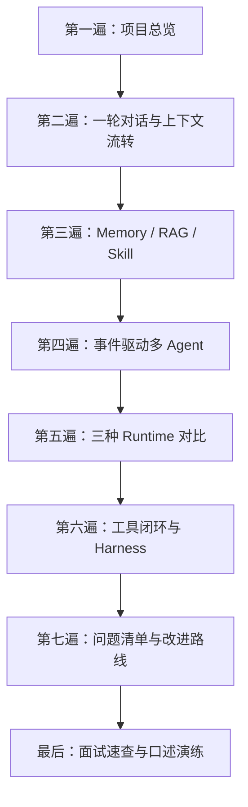

# MindBridge 深度解读文档

这套文档不是通用 Agent 教程，而是对当前本地 `mindbridge-py` 源码的逆向说明。目标是让你能够回答三类面试问题：

1. 这个项目端到端是怎样运行的？
2. 某个模块具体落在哪些类、数据结构和异常路径上？
3. 为什么这样设计，哪里只是 Demo 级实现，下一步怎样演进？

## 事实口径

| 标记 | 判断标准 |
|---|---|
| ✅ 已实现 | 当前主链路真实调用，源码行为闭合 |
| 🟡 部分实现 | 有核心结构，但持久化、治理、覆盖或接线不完整 |
| 🔴 未接线 | 类、表或配置存在，当前主链路没有调用 |
| 🧪 已验证 | 本地单元测试或 Engineering Harness 已实际通过 |
| ⚠️ 已复现问题 | 已通过源码检查或本地命令稳定复现 |
| 💡 改进建议 | 当前没有实现，是文档提出的演进方向 |

特别注意：“类存在”“表存在”“配置存在”都不自动等于“能力已经生效”。例如项目定义了 `ToolGovernanceService` 和 `tool_audit_records`，但 Tool Queue 当前没有调用治理服务，因此应标记为“未接线”，不能在面试中说成已经实现了运行时工具授权。

## 推荐学习路线



如果时间只有 30 分钟，依次阅读：

1. [项目总览](01-project-overview.md)
2. [上下文流转](02-context-flow.md)
3. [事件驱动多 Agent](07-multi-agent.md)
4. [Runtime 对比](08-runtime-comparison.md)
5. [面试手册](12-interview-handbook.md)

如果要真正掌握源码，按下面顺序完整阅读。

## 文档目录

| 文档 | 你读完后应能回答 |
|---|---|
| [01 项目总览](01-project-overview.md) | 系统边界、分层、启动过程和一轮聊天的主链路是什么？ |
| [02 上下文流转](02-context-flow.md) | 原始输入、脱敏输入、历史消息、摘要、检索结果、prompt、token、trace 分别怎样流动？ |
| [03 工具调用](03-tool-calling.md) | 工具怎样注册和执行？结果存在哪里？解析失败、重试、依赖、限流、死信怎样处理？ |
| [04 记忆](04-memory.md) | 短期、长期归档、工作记忆和 Agent 私有记忆分别是什么？什么时候压缩？是否持久化摘要？ |
| [05 RAG](05-rag.md) | 文档如何切片、索引、混合召回、融合、重排、扩展？何时降级？ |
| [06 Skill](06-skills.md) | `SKILL.md` 怎样加载、校验、选择和注入？是否做了渐进式披露？ |
| [07 多 Agent](07-multi-agent.md) | Task、Claim、Message、Artifact、Event、Blackboard 和 Coordinator 如何协作？ |
| [08 Runtime 对比](08-runtime-comparison.md) | 事件驱动、LangGraph 和自研顺序 Runtime 如何选择？状态与控制流有什么差异？ |
| [09 Harness](09-harness.md) | Runtime Harness 和 Engineering Harness 各解决什么问题？为什么需要两层？ |
| [10 持久化、可观测性与安全](10-persistence-observability-safety.md) | 各张表由谁写、谁读？trace 记录什么？风险与隐私边界如何实现？ |
| [11 缺口与演进路线](11-gaps-and-roadmap.md) | 当前实现有哪些已证实问题？应按什么优先级改？ |
| [12 面试手册](12-interview-handbook.md) | 怎样用 1 分钟、5 分钟和 15 分钟讲项目？面试官会追问什么？ |
| [源码证据地图](appendix-source-map.md) | 每个模块对应哪些文件、符号、配置、表和测试？ |
| [交付计划](00-delivery-plan.md) | 文档的范围、证据等级和验证基线是什么？ |

## 当前最重要的事实结论

### 1. 默认主路径是事件驱动多 Agent

`Settings.agent_framework` 的代码默认值是 `event_driven_multi_agent`，当前本地非敏感配置读取结果也是该值。`create_agent_runtime()` 按配置选择：

```text
event_driven_multi_agent / multi_agent / actors
    -> EventDrivenAgentRuntimeService

langgraph 且依赖可导入
    -> LangGraphAgentRuntimeService

其他值，或请求 langgraph 但依赖不可用
    -> AgentRuntimeService
```

不过 `docker-compose.yml` 把容器默认值写成了 `langgraph`，所以“默认 Runtime”必须说明运行环境：裸代码默认和 Docker Compose 默认并不一致。

### 2. Agent 的输出不是最终文本

Agent Runtime 返回的是 `list[AiMessage]`，本质上是一组准备好的 system/user prompt。真正面向学生的文本由 `ChatService` 随后调用全局 `AiClient.stream()` 生成。因此事件驱动模式中的 `ResponseAgent` 是“回复方案/prompt 生成 Agent”，不是直接输出最终自然语言的 Agent。

### 3. 记忆不是一个存储

```text
MySQL chat_messages
    完整聊天归档，Redis 为空时用于回填

Redis mindbridge:short-term-memory:{session}
    有 TTL 和最大条数的短期消息窗口

Redis mindbridge:short-term-memory:agent:{agent}:{session}
    事件驱动模式的 Agent 私有决策记忆

CollaborationBlackboard / AgentContext
    只活在单轮进程内的工作记忆
```

当前没有独立的“长期语义用户画像/事实记忆库”。MySQL 是长期归档，但系统不会从全部历史中做语义检索，只在 Redis 为空时按最近消息回填。

### 4. 工具不是由模型自由发起

当前主路径不是 ReAct 式 function calling。Runtime 根据咨询/风险结果生成心理报告；Harness 再生成确定性的 `AgentToolPlan`；随后：

- 队列开启：写入 `tool_jobs`，后台线程执行；
- 队列关闭：MCP client 通过 stdio 启动本项目 MCP server，按固定顺序调用工具。

因此工具选择是业务规则驱动，而不是模型返回 `tool_calls` 后动态注册、校验和执行。

### 5. RAG 有真实降级，但不是所有场景都进入 RAG

只有 `CONSULT / RISK` 或非低风险场景才检索。检索主路径是向量 + BM25 候选融合 + 本地重排；Chroma、API Key 或 embedding 调用不可用且 `knowledge_vector_required=false` 时，向量候选变为空，系统自然退化为 BM25 + 本地词法重排。

### 6. Skill 做了“选择性注入”，但不是完整渐进式披露

模型 prompt 只注入规则选中的 Skill 正文，这是粗粒度渐进式披露。可是运行时选择依赖硬编码关键词，`get_required()` 每次会重新扫描并加载全部 `SKILL.md`，也没有“元数据目录 → 正文 → references/assets”多级加载。因此不能说成完整的 Codex 式渐进式披露。

### 7. Harness 有两层

- `MindBridgeAgentHarness`：生产单轮运行编排门面，属于业务架构。
- `app.harness.runner`：用 Mock AI、SQLite 和内存记忆执行端到端工程验收，属于测试基础设施。

两者名字相似，但职责完全不同。

## 当前验证基线

2026-08-02 在本地虚拟环境执行：

```powershell
.\.venv\Scripts\python.exe -m unittest discover -s tests -v
```

结果：17 个单元测试全部通过。

执行：

```powershell
.\.venv\Scripts\python.exe -m app.harness.runner
```

结果：

| Harness | 结果 |
|---|---|
| Risk Safety | PASS |
| Agent Routing | PASS |
| Standard Skills | FAIL |
| RAG | PASS |
| API | FAIL |
| Tool Queue | PASS |

两个失败首先由同一个跨平台问题触发：实现返回 Windows 反斜杠路径，Harness 却只接受以 `/SKILL.md` 结尾的字符串。完整原因及被提前失败遮住的 API 缺口见 [缺口与演进路线](11-gaps-and-roadmap.md)。

## 怎样使用这套文档准备面试

不要背类名列表。建议按“问题—状态—决策—副作用—失败路径”复述：

```text
用户输入是什么
-> 进入哪种状态
-> 哪个组件做决策
-> 产生了什么 artifact / prompt / DB 写入
-> 外部依赖失败时怎样降级
-> 哪些结果对学生可见，哪些只在后台
```

面试官追问某个细节时，再回到源码证据地图定位到类和方法。

